## 1. Введение 

1. Начнем с создания миграции

```python
python manage.py makemigrations
```

2. Создадим таблицы в базе данных (БД)
```python
python manage.py migrate
```

3. Запустим сервер
```python
python manage.py runserver
```

Перейдем по http://127.0.0.1:8000/ и увидим, что чего-то не хватает. Так как основное наполнение идет через базу данных 
(БД). Для этого произведем загрузку(перенос) данных в БД из её фикстуры(слепка). В фикстуре содержится вся информация о заполнении БД.
Однако, фикстура это всего лишь заполнение БД, без структуры (какие именно таблицы и какие есть связи в БД), которую 
мы переносили при помощи команды (`migrate`) фикстуру не применить.

Ознакомьтесь с содержанием файла `data_db.json` по ключевому слову `app.entry` в этом файле найдите статьи, ознакомьтесь с
полями у этой таблицы.

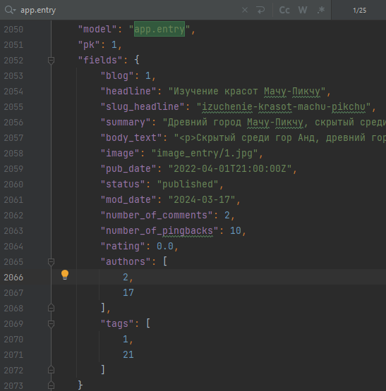

4. Теперь загрузим эти данные (фикстуру)
```python
python manage.py loaddata data_db.json
```

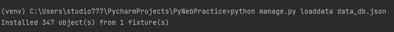

Так как данные уже есть в БД, то `Блог` показывает нужную информацию.


## 2. Знакомство с административной панелью

Django в отличие от большинства других библиотек или фреймворков обладает встроенной административной панелью (но и в других 
библиотеках можно скачать модулю которые закроют данный функционал, если он требуется). Административная панель это страница, с
базовыми функциями для администрирования сайта. С помощью админ понели достаточно просто и удобно работать со значениями таблиц БД. 

Чтобы зайти в неё достаточно перейти по адресу http://127.0.0.1:8000/admin

В курсах ранее мы с вами создавали суперпользователя(он же админ) используя команду `manage.py createsuperuser`, но 
пока этого не нужно, необходимые пользователи и админ был загружен через фикстуру.

Зайдите в админ панель по адресу http://127.0.0.1:8000/admin под: 

Username: `admin`
Password: `123`

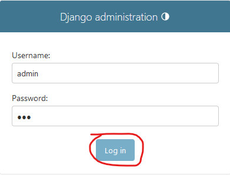

Затем попадаете в само отображение админ панели, где на данный момент есть 2 блока
`Authentication and Authorization` и `Приложение`. 

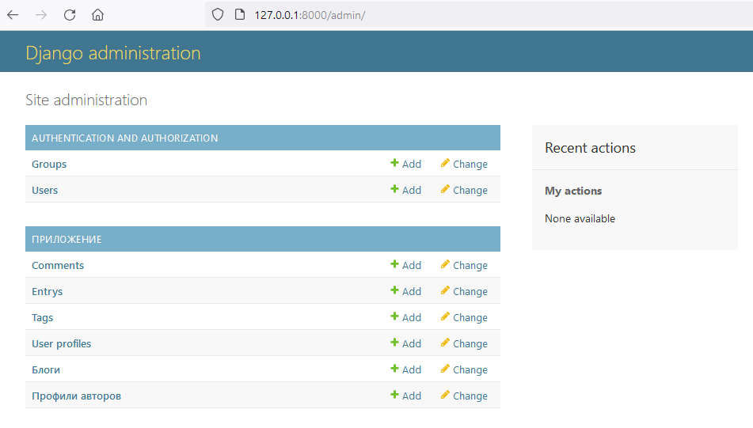


Визуальное отображение админ панели можно изменить при помощи сторонних библиотек, кому интересно, то подробнее 
можно почитать [здесь](https://docs.google.com/document/d/1S9bGmy-83u-7P2b-Kpt1tVUQqiBAGRS5RUxyJkLQ6yQ/edit?usp=sharing) (информация только для интересующихся, 
выполнять в рамках практики примеры из материала не нужно).

### 2.1 Аутентификация и авторизация

Первый блок посвящен системе аутентификации (определение кто зашел на страницу, какой пользователь) 
и авторизации (определение какие права есть у данного пользователя, что ему можно показывать, а что нет)


Все пользователи содержатся в `Users`, зайдите на вкладку и посмотрите на текущих пользователей в БД. Всего будет 41 пользователь,
Один админ, 5 пользователей со статусом персонала (staff status будет с зеленой галочкой) и 35 обычных пользователей.

Создайте нового пользователя через admin панель, для этого нажмите на `+Add` на левой панели в строке `Users`.

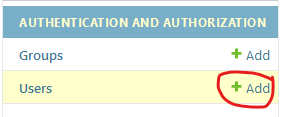

Придумайте Username, а также пароль, повторите пароль. В этот раз придётся соблюсти правила защищенного пароля. 
`123456 не пропустит форма`, но чтобы не выдумывать сложный пароль для теста, можно на английской клавиатуре пробежаться 
змейкой от 1 вниз до 2 вверх с зажатым Shift. Пароль тогда будет такой `!QAZXSW@` такой пароль Django пропустит. Затем
нажмите на `Save`

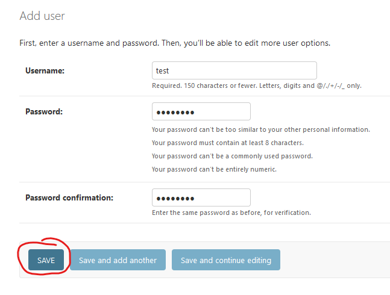

Далее появится дополнительная информация о пользователе, где можно заполнить персональные данные, а также поработать с 
разрешениями (permissions) и если это необходимо наделить созданного пользователя правами персонала (staff status) или админа 
(superuser status). Также возможно добавить пользователя в определенные группы разрешений (про это рассмотрим далее).

Если сделали какие-то изменения на данной странице, то чтобы они принялись, то необходимо внизу страницы нажать на `Save`

Далее перейдите в таблицу `Groups` в левой панели, и вы увидите, что уже есть одна группа, она была загружена из фикстур, это группа `Авторы`

Создайте новую группу, название на ваше усмотрение, в моём случае пусть это будет `Группа`, далее вы можете раздать определенные права пользователям на действия над данными в этой группе.

Допустим можно делать следующие действия со строками в таблицах БД:
* добавлять данные (Can add)
* изменять данные (Can change)
* удалять данные (Can delete)
* просматривать данные (Can view)

Возьмите и перенесите права над `auth | user` из левой колонки в правую, для этого нажмите двойной щелчок левой кнопки мыши на необходимой
строке права или выделите строку и нажмите на символ стрелки вправо.

Сохраните данную группу.

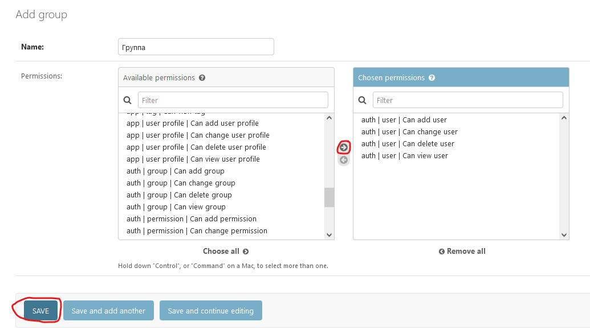

Теперь перейдите в таблицу `Users` и нажмите на пользователя `amoskonstantinov`, чтобы изменить значения его значений в БД.

Пролистаем вниз до поля `Groups` и перенесем в правую таблицу вашу созданную группу, если делали как и я, то это будет `Группа`

Чуть ниже есть возможность раздавать права отдельным пользователям (если это необходимо), а не целой группе.

Обязательно сохраняем изменения! Нажимаем на `Save`.

Теперь проверим, что поменялось после раздачи прав. Разлогинимся, для этого справа вверху есть `LOG OUT`

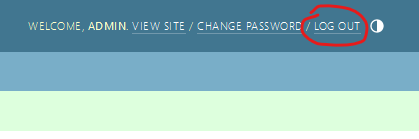

И теперь залогинимся под недавно измененным пользователем 

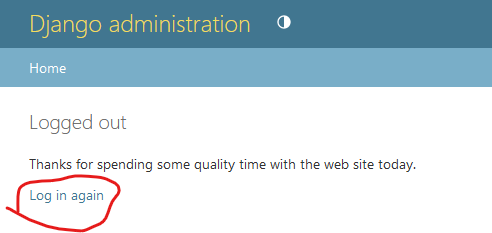

Username: `amoskonstantinov`
Password: `Or5G_uRh)V`

И вы увидите, что этому пользователю доступны только действия над элементами таблицы `Users` в БД, ровно то, что 
мы и разрешали для группы.

Если зайти под пользователем с staff status, но без единого разрешения, то страница будет достаточно пустой, как на примере
данного пользователя

Username: `budimir2021`
Password: `J2GzZvp!_c`

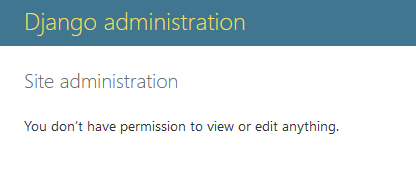

А если зайти под обычным пользователем, не персоналом, то в админ панель его не пустят, как например

Username: `arhip_35`
Password: `RbT9Zu7rg%`

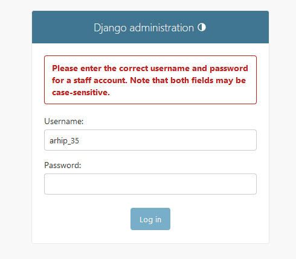

Пароли и username остальных пользователей (если это необходимо) приведены в `users.json`, который создадим на 2-ой практике.

### 2.2 Основные таблицы приложения Блог

В приложении существует 6 таблиц

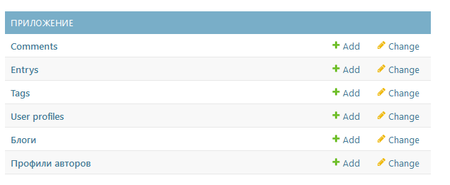

* `Comments` - таблица с комментариями	

* `Entrys` 	- таблица с записями статей

* `Tags`	- таблица с тегами статей

* `User profiles` - таблица с профилями пользователей	

* `Блоги`	- таблица с существующими блогами в приложении

* `Профили авторов`- таблица с профилями авторов

Добавим новую статью на блог-платформу, для этого нажмем на `+Add` в строке `Entry`

Создайте новую статью. Жирным выделены названия тех параметров, что обязательны для заполнения. Картинку можете загрузить свою, если есть желание
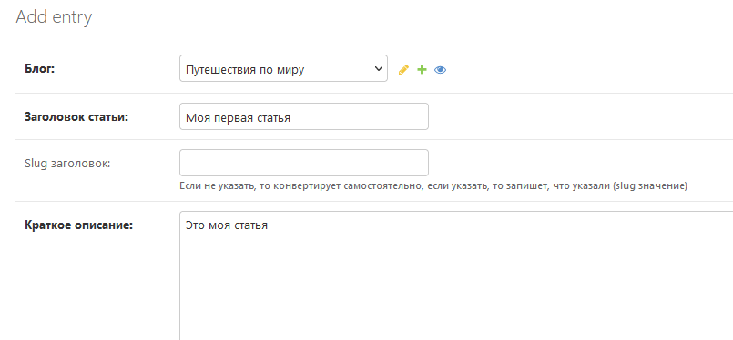

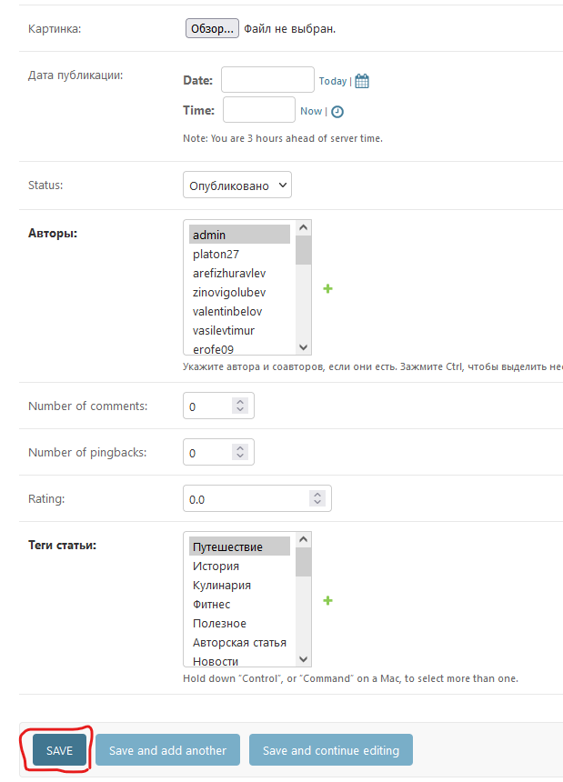

После заполнения создайте свою первую запись на платформе через админ панель.

Теперь в БД есть запись созданная через админ панель.

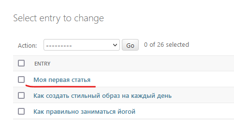

Наблюдать за результатом возможно на главной странице приложения. http://127.0.0.1:8000/

Пролистайте начальную страницу немного вниз и увидите свой пост.


Однако к БД можно подключить не только через админ панель, но и через любой обозреватель БД поддерживающий данную БД.
По умолчанию БД в Django создаётся через SQLite, наша БД не исключение (в будущем рассмотрим извeстную нам PostgreSQL).

К SQLite можно подключиться через [SQLiteBrowser](https://sqlitebrowser.org/dl/) или [DBeaver (Community)](https://dbeaver.io/download/) 
или другие менеджеры и обозреватели БД.

Рассмотрим `Dbeaver`.

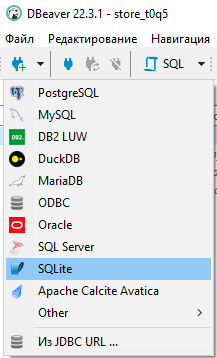

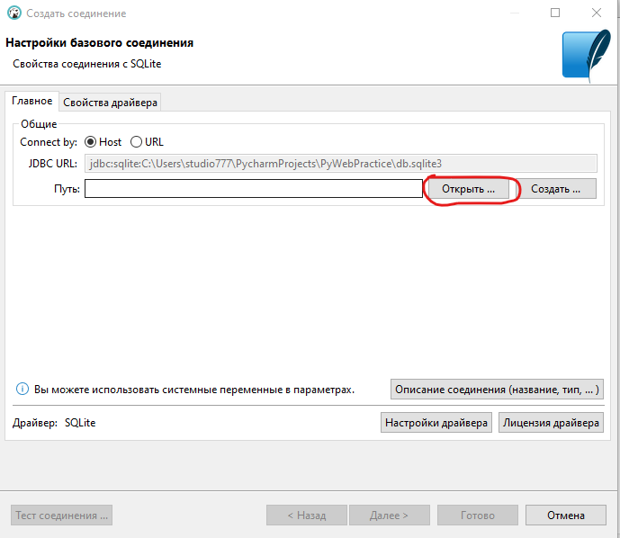

Открываем базу данных из проекта

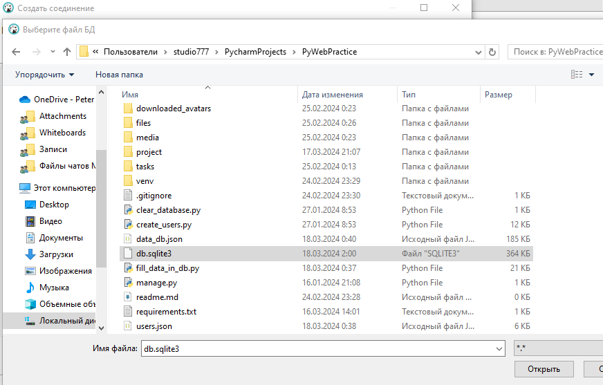

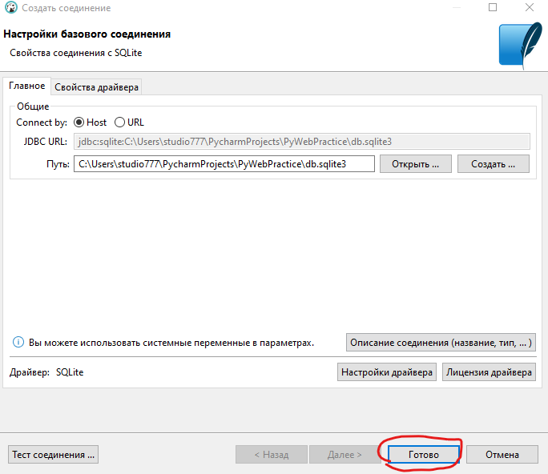

И если это необходимо используем данные из таблиц


Далее разберем как создать свои модели (таблицы в БД) в Django и как можно получать информацию из БД не через админ панель.

## 3. Создание моделей в Django

Модели - это класс в котором описывается наполнение таблицы в БД и определенные связи. 
Модель состоит из названия таблицы и наполнения полей которые там участвуют + дополнительные параметры и возможности.

Стандартно модели прописываются в файле `models.py` своего приложения. 

Откройте файл `models.py` приложения `db_train`, которое находится в папке `apps`

Создадим модель `Author`, для этого необходимо создать одноименный класс `Author`, который наследуется от `models.Model`

```python
class Author(models.Model):
    pass
```

Теперь наполним данную модель(таблицу) описанием полей(колонок) которые она буде хранить.

Для создания поле внутри класса пишут классовый атрибут, причем название этого атрибута соответствует названию поля в 
БД которое мы хотим создать для хранения там данных. В классовый атрибут записывается экземпляр созданный на базе определенного типа данных.

Например:

```python
class Author(models.Model):
    first_name = models.CharField()
```

Данным кодом было объявлено поле `first_name`, которое представляет собой строковый тип (CharField). Говорящее о том, что в данном поле
будут храниться данные в строковом типе.

### 3.1 Описание полей

ORM Django поддерживает множество типов полей рассмотрим часто применяемые:
* Поле для хранения целого числа - `models.IntegerField()`;
* Поле для хранения вещественного числа - `models.FloatField()` для чисел типа float, `models.DecimalField` для чисел с фиксированной точностью 
(допустим финансовых операций с 2-умя значениями после запятой);
* Поле для хранения булевого значения - `models.BooleanField()` для хранения `True` или `False`;
* Поле для хранения бинарных данных - `models.BinaryField()`. Допустим так можно сохранить документ или картинку в базу данных целым файлом;
* Поле для хранения строки - `models.CharField()` для небольших предложений или слов размером до 255 символов, можно явно указать максимальный размер строки;
* Поле для хранения многострочного текста - `models.TextField()` для больших предложений;
* Поле для хранения строки email - `models.EmailField()`
* Поле для хранения текста slug типа - `models.SlugField()`
* Поле для хранения даты - `models.DateField()`
* Поле для хранения даты со временем - `models.DateTimeField()`
* Поле для хранения файла - `models.FileField()`
* Поле для хранения картинки - `models.ImageField()`

Каждый тип поля в Django соотносит возможности по хранению для конкретной БД. То есть если в БД есть возможность хранить `email`, 
так как этот тип поддерживается на уровне БД, то будет явная связь с этим типом. 
Если такого типа не поддерживает БД, то Django свяжет его со строковым типом, но сделает определенные
валидации внутри себя перед сохранением, чтобы убедиться, что передаваемое значение в БД соответствует типу `email`.

Более детально про эти и другие типы можно прочитать в [документации](https://docs.djangoproject.com/en/5.0/ref/models/fields/#field-types) 
или в файле в `fields_and_types.md` в разделе `1. Описание полей`


Предположим, что на начальной стадии (не задумываясь о том как будем работать со сложными связями и таблицами) для полноценного описания данных об Авторе
нам достаточно следующих данных(получилось много, но для тренировки самое то):

| Поле                                | Имя поля     | Тип поля         | Класс описания       |
|-------------------------------------|--------------|------------------|----------------------|
| имя авторского аккаунта             | username     | slug             | models.SlugField     |
| email                               | email        | email            | models.EmailField    |
| имя                                 | first_name   | строковое        | models.CharField     |
| фамилия                             | last_name    | строковое        | models.CharField     |
| отчество                            | middle_name  | строковое        | models.CharField     |
| пол                                 | gender       | строковое        | models.CharField     |
| уровень самооценки                  | self_esteem  | decimal          | models.DecimalField  |
| телефон                             | phone_number | строковое        | models.CharField     |
| город                               | city         | строковое        | models.CharField     |
| биография                           | bio          | текстовое        | models.TextField     |
| возраст                             | age          | целое            | models.IntegerField  |
| дата рождения                       | date_birth   | дата             | models.DateField     |
| согласие с правилами                | status_rule  | булевое          | models.BooleanField  |
| фото профиля                        | image        | картинка         | models.ImageField    |
| дата и время создания записи в БД   | create_at    | дата со временем | models.DateTimeField |
| дата и время обновления записи в БД | update_at    | дата со временем | models.DateTimeField |

Колонок много, однако они описывают все часто используемые типы полей.

После того как определились с тем чем будет описываться наша сущность, то необходимо настроить поведение и обработку полей. 
Это делается при помощи параметров передаваемых в класс описания поля при его инициализации.

Параметры можно разбить на 2 группы:
* `Общие параметры`, которые можно передать в каждый класс описание. `Все общие параметры являются необязательными, т.е.
их нужно указывать, если хотите добавить или поменять функционал, что есть по умолчанию`.


* `Частные параметры`, которые разнятся от класса, но в большинстве своём идут в дополнение к общим. 
В зависимости от класса поля есть параметры которые обязательно нужно определить.

`Общие параметры` в свою очередь разбиваются на:
1. Те, что используются для `отображения в админ панели` или формах:

   * `verbose_name` - Определяет человекочитаемое имя поля. Передаётся если хотите, чтобы поле отображалось в админ панели
как передали, так как умолчанию оно отображается как именовали при названии классовой переменной;

   * `blank` - По умолчанию `False`. Определяет, может ли поле отображаться как пустое 
(аналог отображения необязательного поля для ввода). Есть передать `True`, то 
отображение становится менее ярким, название поля становится не жирное;

   * `editable` - По умолчанию `True`. Определяет, может ли поле отображаться для редактирования. Есть передать `False`, 
то админ панели данное поле отображаться не будет;

   * `help_text` - По умолчанию `None`. Отображает вспомогательный текст или инструкции для поля. Текст в админ панели 
отображается маленькими буквами под полем;

   * `error_messages` - Позволяет определить пользовательские сообщения об ошибках для поля. 
Вы можете переопределить предопределенные сообщения об ошибках, такие как null, blank, invalid, и другие.
   
   * `choices` - Позволяет ограничить список допустимых значений, которые могут быть присвоены определенному полю. 
Используется для создания поля с предопределенным набором вариантов выбора (выпадающий список). 
Параметр `choices` принимает список кортежей, где каждый кортеж содержит два элемента: значение и человекочитаемое 
(которое будет отображаться в админ панели или форме) представление значения.
   

2. Те, что используются для `настройки действий с БД`:

   * `null` - По умолчанию `False`. Определяет, может ли поле в БД хранить значение NULL.
   
   * `unique` - По умолчанию `False`. Определяет, должно ли поле содержать уникальные значения.
   
   * `default` - Устанавливает значение по умолчанию для поля. Если создавать объект базы данных и не передать
значение полю, то в него запишется значение по умолчанию). Значение может быть указано в виде конкретного значения 
или в виде вызова функции. Если не задать параметр `null` или `default`, то механизм Django будет требовать обязательно заполнить поле.

   * `primary_key` - По умолчанию `False`. Указывает, является ли поле первичным ключом модели. 
По умолчанию, первичным ключом является id в вашей таблице, но вы можете использовать этот параметр со значением `True`, 
чтобы явно указать поле в качестве первичного ключа. `Во всей таблице только одно поле может быть с параметром primary_key=True`.
   
   * `validators` - Позволяет задать список пользовательских валидаторов. По умолчанию вызывает встроенные валидаторы для своего поля, 
но передав сюда список валидаторов вызывает их после встроенных валидаторов. 
Валидаторы используются для проверки вводимых данных и обеспечения их соответствия определенным условиям `до передачи данных на сохранение в БД`.
   
   * `db_column` - Указывает название столбца в базе данных, к которому привязано поле. 
Если параметр не указан, Django будет использовать имя поля в качестве названия столбца.
   
   * `db_index` - По умолчанию `False`. Определяет, должен ли быть создан индекс для данного поля в базе данных.

   * `db_tablespace` - Указывает название табличного пространства базы данных, в котором должно храниться поле. 
Если параметр не указан, Django будет использовать значение по умолчанию (смесь названия приложения и названия модели) 
для базы данных.

`Частные параметры` в свою очередь зависят от поля, рассмотрим примеры:

* поля `models.CharField`, `models.BinaryField` обладают `обязательным` параметром `max_length`. Максимальная длина (в символах) поля. 
`max_length` применяется на уровне базы данных и при проверке Django использует встроенный валидатор на проверку 
максимальной длины `MaxLengthValidator`


* поля `models.EmailField`, `models.URLField`, `models.SlugField` тоже обладают параметром `max_length`, только в данном
случае по умолчанию уже они определены и их можно не задавать, если устраивает ограничение.


* поле `models.DecimalField` обладает `обязательными` параметрами:
  * `max_digits` - Максимально допустимое количество цифр в числе; 
  * `decimal_places` - Количество десятичных разрядов для хранения с числом. 
  
Пример для максимально поддерживаемого числа 999.99 (значение 1000.0 и выше уже не будет поддерживаться)
`models.DecimalField(max_digits=5, decimal_places=2)`


* поля `models.DateField`, `models.DateTimeField` обладают `необязательными` параметрами `auto_now` и `auto_now_add`. 
Одновременно можно задать только один из этих параметров. 

  * `auto_now` - По умолчанию `False`. Если `True`, то автоматически устанавливает текущее временное значение каждый раз, когда объект `сохраняется`. 
Полезно для отметок времени последнего изменения строки в БД.
  * `auto_now_add` - По умолчанию `False`. Если `True`, то автоматически устанавливает поле на текущее временное значение, когда объект `создается впервые`. 
Полезно для отметок времени создания строки в БД.
  
* поля `models.FileField`, `models.ImageField` обладают `необязательным` параметром `upload_to`. Этот атрибут обеспечивает способ указания каталога загрузки и имени файла 
и может быть установлен двумя способами (строкой и функцией, которая выполнится при сохранении)

Подробнее про передаваемые параметры можно прочитать в [документации](https://docs.djangoproject.com/en/5.0/ref/models/fields/#field-options) 
или файле `fields_and_types.md` в разделе `2. Общие параметры поля` и описание частных параметров в `1. Описание полей`.

### 3.2 Применение параметров 

Далее определим какие ограничения мы хотим использовать на наши поля:

Имя, Фамилия, Отчество, Город ограничим длиной в 100 символов;

```python
models.CharField(max_length=100)
```

Пол ограничим стандартными фразами `мужской`, `женский`, для этого воспользуемся параметром `choices` (при выборе 
в админ панели `мужской` в БД запишется `м`, при выборе `женский` в БД запишется `ж`), с ограничением длины в 1 символ.

```python
gender = models.CharField(max_length=1, choices=[('м', 'мужской'), ('ж', 'женский')])
```

Телефон ограничим длиной в 12 символ, по стандарту +79991234567

```python
phone_number = models.CharField(max_length=12)
```

Уровень самооценки ограничим одним знаком до разделителя от 0 до 5 и одним знаком после разделителя.

```python
self_esteem = models.DecimalField(max_digits=2, decimal_places=1)
```

Так как у нас есть дата рождения и возраст и возраст вытекает из даты рождения, то скроем возможность задания возраста 
и будем его вычислять перед сохранением в БД (это реализуем чуть позже), сейчас только скроем поле и 
сделаем возможность устанавливать его как NULL в БД.  

```python
age = models.IntegerField(null=True, editable=False)
date_birth = models.DateField()
```

Фото профиля хотим, чтобы загружалось в папку `foto_profile` на нашем сервере для это прописываем это в `upload_to`

```python
image = models.ImageField(upload_to='foto_profile')
```

Для работой с датой и временем создания и обновления записи в БД используем `auto_now=True` и `auto_now_add=True`. В админ панели не будет отображаться, 
будет заполняться автоматически при сохранении в БД. 

```python
create_at = models.DateTimeField(auto_now_add=True)
update_at = models.DateTimeField(auto_now=True)
```


В итоге теперь наша модель будет выглядеть так:

```python
class Author(models.Model):
    username = models.SlugField()
    email = models.EmailField()
    first_name = models.CharField(max_length=100)
    last_name = models.CharField(max_length=100)
    middle_name = models.CharField(max_length=100)
    gender = models.CharField(max_length=1, choices=[('м', 'мужской'), ('ж', 'женский')])
    self_esteem = models.DecimalField(max_digits=2, decimal_places=1)
    phone_number = models.CharField(max_length=12)
    city = models.CharField(max_length=100)
    bio = models.TextField()
    age = models.IntegerField(null=True, editable=False)
    date_birth = models.DateField()
    status_rule = models.BooleanField()
    image = models.ImageField(upload_to='foto_profile')
    create_at = models.DateTimeField(auto_now_add=True)
    update_at = models.DateTimeField(auto_now=True)
```


### 3.3 Создание таблицы в БД

После того как определись с наполнением таблицы, то самое время её создать в БД. Для этого выполняем команду

```python
python manage.py makemigrations
```

Чтобы создать питоновскую связь с таблицей в БД.

Вы можете увидеть следующее, говорящее о том, что связь создана. Посмотреть как выглядит эта связь можно в соответствующей папке

`apps/db_tain/migrations/0001_initial.py`

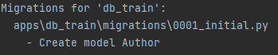

Затем переносим схему таблицы в БД, для этого прописываем

```python
python manage.py migrate
```

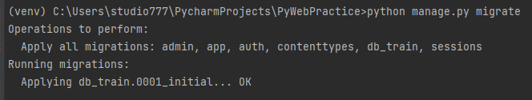

Теперь самое время зайти в админ панель и посмотреть на наше творение!

Но вот незадача, админ панель не показывает нашу таблицу

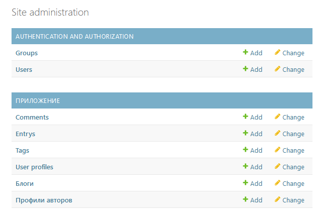

Чтобы произошло отображение таблицы, то необходимо её зарегистрировать. Для этого существует специальный файл `admin.py` 
для отображения и настройки админ панели для данного приложения.

Зайдите в приложение `db_train`, затем в файл `admin.py`

И пропишите следующее(подгружаем таблицу из моделей и регистрируем её для отображения в админ панели):

```python
from django.contrib import admin
from .models import Author

admin.site.register(Author)
```

Теперь таблица на месте

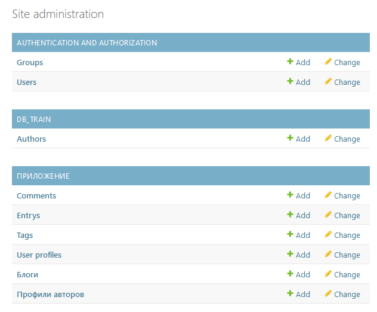

Создайте одного автора, через административную панель. 

К сожалению по умолчанию поле ввода даты не обладает быстрой прокруткой по годам,
поэтому будет проще вбить данные в формате `yyyy-mm-dd`

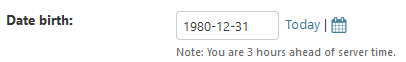

Если какое-то поле будет не заполнено, то вылезет предупреждение

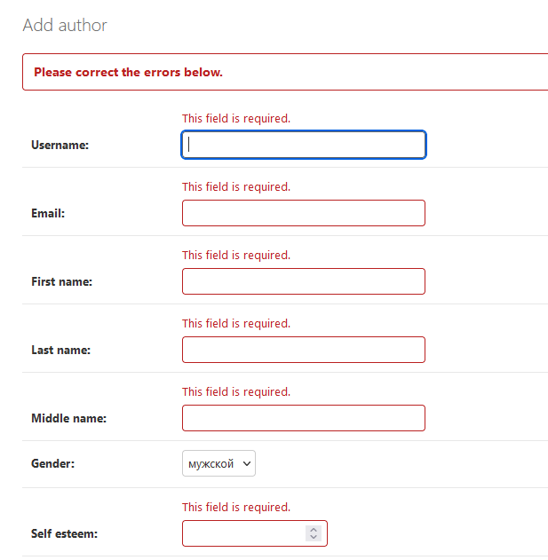

Как только Django создаст строку в БД, то данный автор появится в панели, но вот, что это за автор непонятно

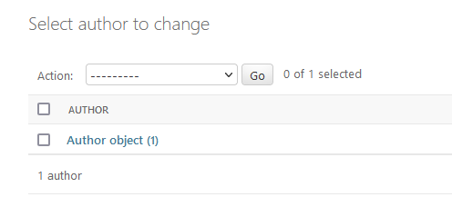

Чтобы сделать эту строку удобочитаемой, необходимо переопределить метод `__str__` в котором вернуть как будет отображаться данная строка.

Переопределите метод в вашем классе `Author`

```python
def __str__(self):
    initials = None  # Инициалы
    if self.first_name and self.middle_name:
        initials = f"{self.first_name.upper()[0]}.{self.middle_name.upper()[0]}."
    return f"{self.username} - {self.last_name} {initials}"
```

Теперь автор более читаемый и понятно кто это

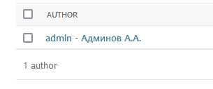


### 3.4 Изменение структуры таблицы в БД

Теперь давайте сделаем модель более удобной для нашей работы. В нашем случае необходимо добавить проверку того, что телефонный номер переданный
в поле соответствует стандартам. Это этого добавим валидацию для этого поля. 

Также изменим отображение названия полей, чтобы было понятно на русском, что это за поле, 
добавим подсказки, и упростим себе задачу по созданию пользователя добавив большинству поле возможность делать их сохранить пустыми в БД. 

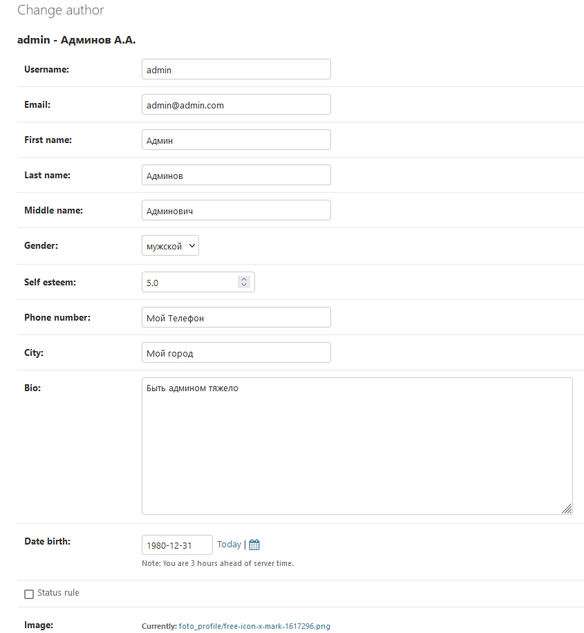

Но перед этим посмотрим куда загрузилась наша картинка? Ранее мы писали папку `foto_profile`, но такой папки нет в корне, а она есть
в папке `media`. Там и лежит ваша картинка.

За то, что корнем для загрузки медиа файлов является папка `media/` отвечает `MEDIA_ROOT` в `settings.py`. При создании проекта
`MEDIA_ROOT` не прописывается автоматические. Если планируется работать с загрузкой файлов на сервер, то этот параметр прописывают.

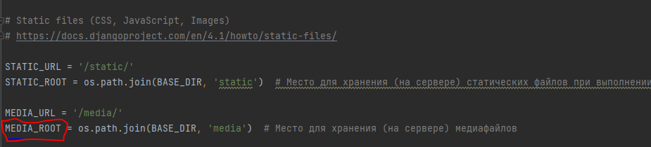


Далее вернемся в `apps/db_train` в `models.py`

По умолчанию в Django нет полей для мобильного телефона, которые будут это валидировать. Чтобы произвести валидацию, 
то необходимо её написать.

Можно использовать функцию для валидации, а можно специальный класс из блока валидаций Django `from django.core.validators import RegexValidator`.

В данном случае будем использовать валидацию с использованием регулярного выражения. Саму переменную которая будет вызываться можно прописать, вне класса Таблицы `Author`. 
А можно как классовый атрибут, это не будет считаться полем, так как мы не создаём экземпляр от типа поля, а экземпляр от валидации. 

Данный валидатор передаём в параметр `validators` в поле `phone_number`

```python
from django.core.validators import RegexValidator

class Author(models.Model):
    phone_regex = RegexValidator(
            regex=r'^\+79\d{9}$',
            message="Телефонный номер должен быть формата: '+79123456789'."
        )
    # ...
    phone_number = models.CharField(max_length=12, validators=[phone_regex])
    # ...
```

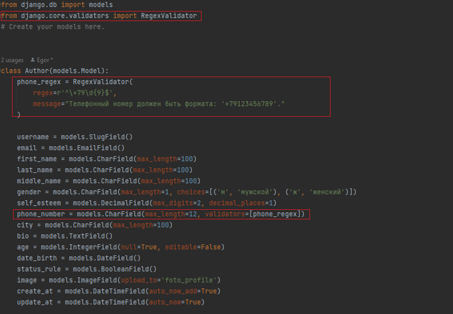

Для уровня самооценки нам тоже нужно поставить ограничения, не меньше 0, не больше 5. Для этого воспользуемся валидаторами
`MinValueValidator`, `MaxValueValidator` из `from django.core.validators import MinValueValidator, MaxValueValidator`


```python
from django.core.validators import MinValueValidator, MaxValueValidator

class Author(models.Model):
    # ...
    self_esteem = models.DecimalField(max_digits=2,
                                          decimal_places=1,
                                          validators=[MinValueValidator(0, "Диапазон [0.0, 5.0]"),
                                                      MaxValueValidator(5, "Диапазон [0.0, 5.0]")])
    # ...
```

Далее изменим отображение названия полей, чтобы было понятно на русском, что это за поле. 
Для этого в каждом поле передадим параметр `verbose_name` и пропишем как будет называться поле.

Чтобы добавить подсказки, передадим параметр `help_text`, где пишется сообщение.

И напоследок упростим себе задачу и сделаем всего несколько полей обязательными, остальными сделаем такими, чтобы 
их можно было оставить пустыми, а в БД запишется или NULL или значение по умолчанию.

В итоге класс теперь выглядит следующим образом:

```python
class Author(models.Model):
    phone_regex = RegexValidator(
        regex=r'^\+79\d{9}$',
        message="Телефонный номер должен быть формата: '+79123456789'."
    )

    username = models.SlugField(verbose_name='Имя аккаунта',
                                help_text="Введите username, не длиннее 50 символов. Использовать нужно английский алфавит, разделять фразы нужно символом '-'")

    email = models.EmailField(verbose_name='Адрес электронной почты',
                              help_text="Адрес почты в формате *@*.*")

    first_name = models.CharField(max_length=100,
                                  verbose_name='Имя',
                                  help_text="Ограничение - не более 100 символов",
                                  null=True,
                                  blank=True,
                                  )

    last_name = models.CharField(max_length=100,
                                 verbose_name='Фамилия',
                                 help_text="Ограничение - не более 100 символов",
                                 null=True,
                                 blank=True,
                                 )

    middle_name = models.CharField(max_length=100,
                                   verbose_name='Отчество',
                                   help_text="Ограничение - не более 100 символов",
                                   null=True,
                                   blank=True,
                                   )

    gender = models.CharField(max_length=1,
                              choices=[('м', 'мужской'), ('ж', 'женский')],
                              verbose_name='Пол',
                              help_text="Выберите пол",
                              null=True,
                              blank=True,
                              )

    self_esteem = models.DecimalField(max_digits=2,
                                      decimal_places=1,
                                      validators=[MinValueValidator(0, "Диапазон [0.0, 5.0]"),
                                                  MaxValueValidator(5, "Диапазон [0.0, 5.0]")],
                                      verbose_name='Уровень самооценки',
                                      help_text="Введите уровень вашей самооценки, только честно! Градация от 0 до 5, где 0 - 'я молодец', 5 - 'я умница'",
                                      null=True,
                                      blank=True,
                                      )

    phone_number = models.CharField(max_length=12,
                                    validators=[phone_regex],
                                    verbose_name='Номер телефона',
                                    help_text="Введите номер телефона через '+7' без пробелов в формате +79123456789 ",
                                    null=True,
                                    blank=True,
                                    )

    city = models.CharField(max_length=100,
                            verbose_name='Город',
                            help_text="Введите название города",
                            null=True,
                            blank=True,
                            )

    bio = models.TextField(verbose_name='Биография',
                           help_text="Напишите здесь о том, почему Вы так хороши",
                           null=True,
                           blank=True,
                           )

    age = models.IntegerField(null=True, editable=False)

    date_birth = models.DateField(verbose_name='Дата рождения',
                                  help_text="Посланцев из будущего не регистрируем!",
                                  null=True,
                                  blank=True,
                                  )

    status_rule = models.BooleanField(verbose_name='Согласие с правилами',
                                      help_text="А ты их читал или как обычно просто галочку поставил?",
                                      )

    image = models.ImageField(upload_to='foto_profile',
                              verbose_name='Картинка профиля',
                              help_text="Фото в профиль, можно не своё! Ну или хоть какое-то. Ладно можно без фото",
                              null=True,
                              blank=True,
                              )

    create_at = models.DateTimeField(auto_now_add=True)
    update_at = models.DateTimeField(auto_now=True)

    def __str__(self):
        initials = None  # Инициалы
        if self.first_name and self.middle_name:
            initials = f"{self.first_name.upper()[0]}.{self.middle_name.upper()[0]}."
        return f"{self.username} - {self.last_name} {initials}"
```

А в панели администратора это выглядит следующим образом

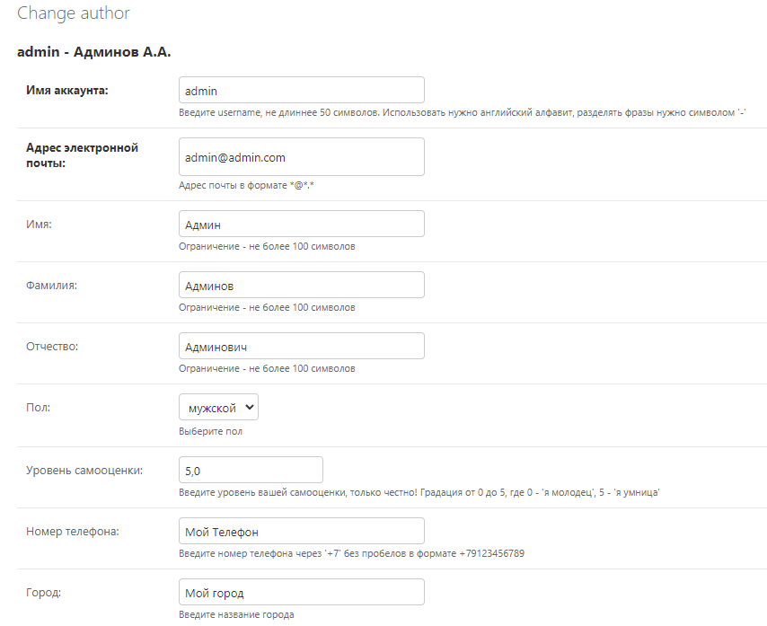
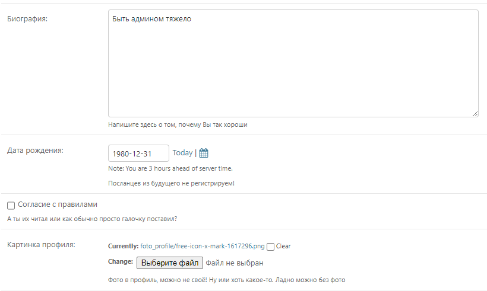

Сделаем ещё одну функциональность, это добавим ограничение на уникальные поля, хочется чтобы `имя аккаунта`, `адрес почты` и `телефон` были уникальные. 
Для этого у данных полей выставляем параметр `unique=True`

```python
username = models.SlugField(# ...
                            unique=True,
                            )

email = models.EmailField(# ...
                          unique=True,
                          )

phone_number = models.CharField(# ...
                                unique=True,
                                )
```

И последняя модификация, это изменение отображения названия таблицы Author. Это делает при помощи метакласса Meta внутри класса.

Чтобы поменять название таблицы для отображения в единственном числе, то переопределяется классовый атрибут `verbose_name`, 
а во множественном - `verbose_name_plural`

```python
class Author(models.Model):
    # ...
    class Meta:
        verbose_name = "Автор"
        verbose_name_plural = "Авторы"
```

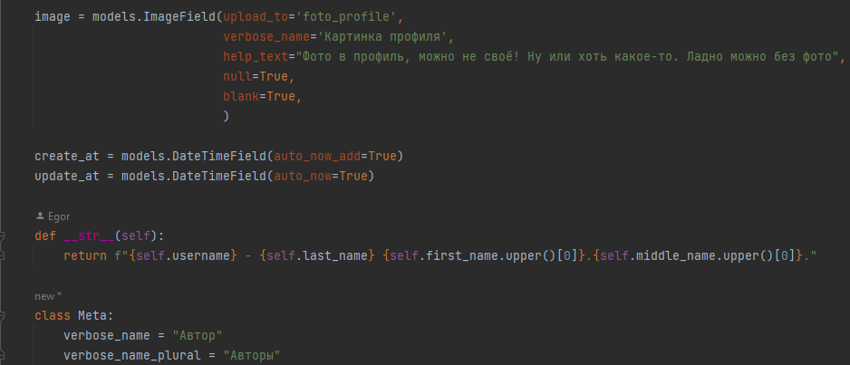

Теперь осталось обновить миграции, для этого вызываем 

```python
python manage.py makemigrations
```

Новые изменения добавились в миграции

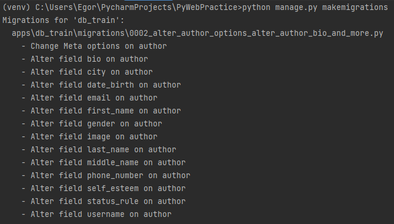

А теперь переносим эти изменения в БД

```python
python manage.py migrate
```

Таким образом мы внесли изменения в структуру БД.

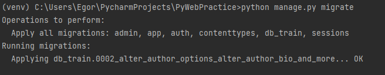

И отображение таблицы стало таким, какое прописывали

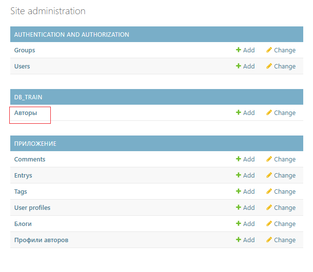

На текущий момент вроде бы всё, но упущен один интересный момент, а именно день рождения есть, а сколько лет мы не передаём, 
хотя такое поле есть в таблице. В таких случаях вычисление происходит непосредственно перед сохранением в БД. Для это
перегружают метод `save` в классе, где приписывают какие действия необходимо совершить при сохранении в БД.

Добавьте данный код в класс `Author`

```python
from datetime import datetime

class Author(models.Model):
    # ...    
    def save(self, *args, **kwargs):
        if self.date_birth:  # Если известен день рождения
            today = datetime.today()  # Определяем текущие параметры даты
            # Определяем добавку, был ли уже день рождения в этом году? Если не был, то 1, если был, то 0
            additional_year = (today.month, today.day) < (self.date_birth.month, self.date_birth.day)
            self.age = today.year - self.date_birth.year - additional_year  # Перезаписываем значение
        super().save(*args, **kwargs)
```

Попробуйте теперь сделать обновление миграций и перенос этих данных в БД.

```python
python manage.py makemigrations
```

```python
python manage.py migrate
```

Вы увидите, что изменений нет, так как написание дополнительных методов или перегрузка методов не меняет структуру таблицы,
это просто дополнительный функционал.

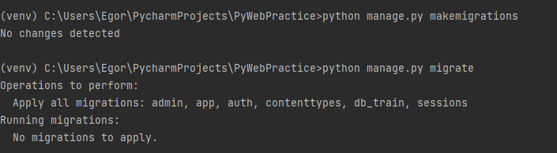

### 3.5 Заполнение данных в БД

Загрузим данные по авторам из ещё одной фикстуры. Фикстура `data_author.json` лежит в папке `files/lab1`

Выполните команду, чтобы загрузить данные из этого файла
```python
python manage.py loaddata files/lab1/data_author.json 
```

Теперь в вашей БД 11 авторов. Добавим ещё одного вручную через консоль `shell`.

Чтобы открыть консоль, введите команду

```python
python manage.py shell
```

Появится интерактивная консоль, где можно выполнять команды и тем самым добавить данные в БД. Но перед этим необходимо 
подгрузить таблицу `Author`. В интерактивной консоли выполните

```python
from apps.db_train.models import Author
```

Весь код приведенный ниже выполняется в интерактивной оболочке 

Создадим авторов 2-умя способами с использованием `save` и через `create`

Для записи данных с использованием save необходимо создать экземпляр, а затем его сохранить. Главное, что значения 
передаются в любой класс таблицы только как `именованные переменные`.

В интерактивной консоли выполните

```python
obj = Author(username='my_author', email='author@author.ru', gender='м', status_rule=True) 
obj.save() 
```

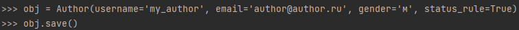

Затем создаём автора через `create`. Для это используется `Author.objects.create`

Чтобы передать дату, необходимо использовать объект `datetime`

Выполните в интерактивной консоли следующий код

```python
from datetime import date
Author.objects.create(username='my_author1', email='author1@author.ru', gender='ж', status_rule=False, date_birth=date(1990, 12,12))
```

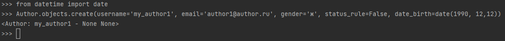

Теперь были созданы 2 автора разными способами.

### 3.6 Получение, изменение, удаление данных из БД

#### Получение

Чтобы получить все элементы, используют конструкцию `objects.all()` в своей таблице.

В нашем случае это

```python
Author.objects.all()
```

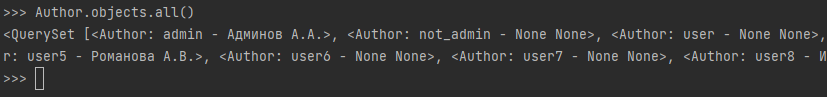

Чтобы получить одну строку в БД, то применяется конструкция `objects.get(поле=значение)` в своей таблице. Где поле - название поля по которому ищем,
значение - искомое значение у поля. Если объект не найден, то вызовется ошибка.

Как пример необходимо получить строку, где у автора имя `Админ`
```python
Author.objects.get(first_name='Админ')
```
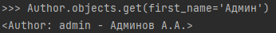


Чтобы получить несколько значений применяют фильтрацию с использованием конструкции `objects.filter(поле=значение)`.

Как пример необходимо получить строки, где пол автора женский, а другим запросом, где мужской

```python
Author.objects.filter(gender='ж')
Author.objects.filter(gender='м')
```

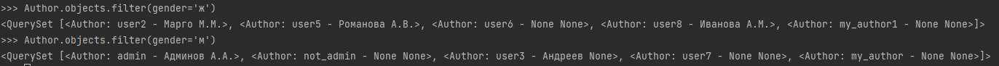

#### Обновление

Чтобы обновить данные, необходимо сначала получить объект из БД, затем обновить его атрибуты и снова его сохранить через `save`.

Пример: получим автора с id=2 и изменим ему название города

```python
author = Author.objects.get(id=2)
>>> author.city = 'Санкт-Петербург'
>>> author.save() 
```

Если есть необходимость, то возможно изменить данные во множестве запросов (queryset), при помощи `update` таким образов в
каждый объект, что есть в queryset в указанное поле(поля) запишутся значения.

Пример: Заменить статус ознакомления `status_rule` на `True` тех авторов, чей город `Москва`

```python
Author.objects.filter(city='Москва').update(status_rule=True)
```

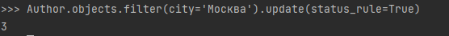

#### Удаление

Чтобы удалить данные, необходимо сначала получить объект из БД, затем удалить его через метод `delete()`.

Пример: Удалить автора с email `author1@author.ru`

```python
author = Author.objects.get(email='author1@author.ru')
author.delete()
```

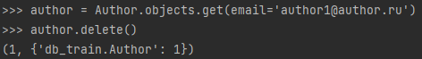


Если требуется удалить несколько элементов и есть множество запросов (queryset), то можно их удалить через это queryset.

Пример: требуется удалить всех авторов, кто не указал город

```python
Author.objects.filter(city=None).delete()
Author.objects.count()  # 7 - Количество оставшихся записей
```

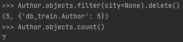

# Практика закончена

---

## **<u>Необязательный блок</u> (выполнение по желанию)**


## 4. Настройка отображения в админ панели


