Здесь будет рассмотрено 2 подхода:

1. Создание БД PostgreSQL на отдельном сервисе (для тех у кого нет возможности локально развернуть БД)

> Для примера рассмотрим сервис render.com

> Можете пройти по [руководству](https://docs.google.com/document/d/1AZAQSEcPhRBPNRxMIKSxN0_4TF4AlOG0kMxEP1e3CTM/edit#heading=h.85bc4nbl9ubi) из немного другого приложения (основные действия те же)
для создания и подключения через render.com.

2. Создание локальной базы данных Postgre на вашем компьютере.

На официальном сайте [Postgre](https://www.postgresql.org/download/) поддерживается большое количество операционных систем. Далее будет рассмотрена
установка и настройка на `ОС Windows`

Есть 2 способа установки:

## 1. Упрощенный через [установщик](https://www.enterprisedb.com/downloads/postgres-postgresql-downloads)

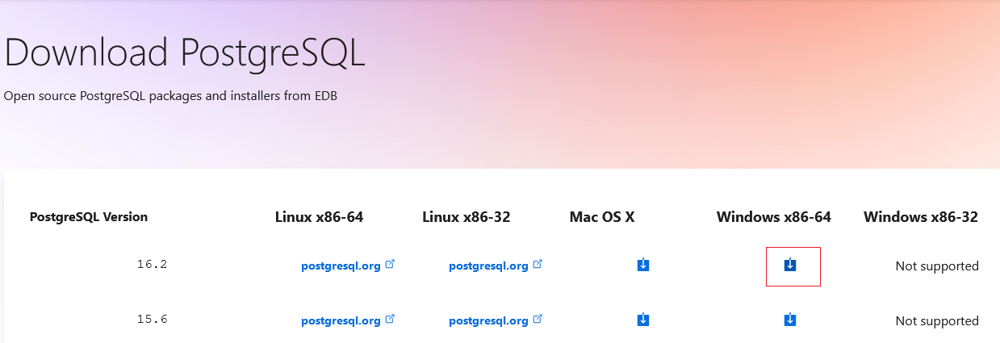

При установке таким методом сложности возникнуть не должно

На одном из этапов будет предложено создать админа. Придумайте username и password для него.


Порт можете оставить по умолчанию

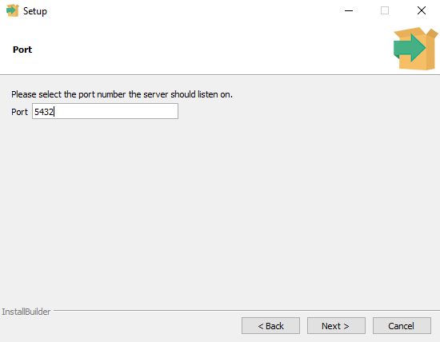

Можно выбрать локализацию или оставить по умолчанию

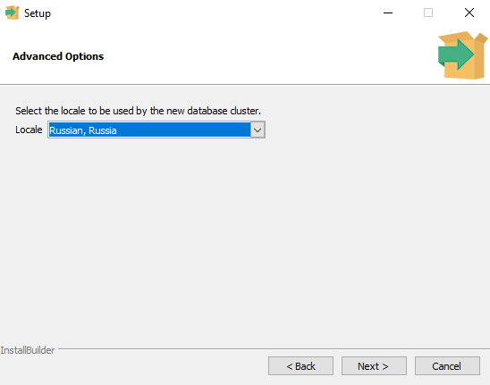

После база данных установится. 

Установщик пакетов можно закрыть.

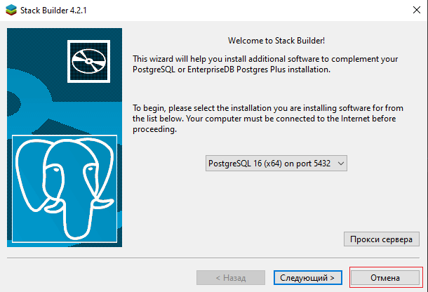

Особенность установки через инсталятор, это то, что создаётся автозапуск БД при старте системы, 
так что её не нужно запускать самостоятельно, что упрощает работу.

Теперь у нас есть БД Postgre, и к ней можно подключиться. Но перед этим зайдем в приложение `pgAdmin4`

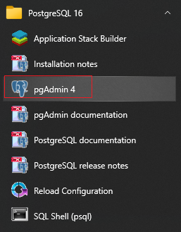

Зайдем под паролем админа (тем что создавали при установке) в админ панель

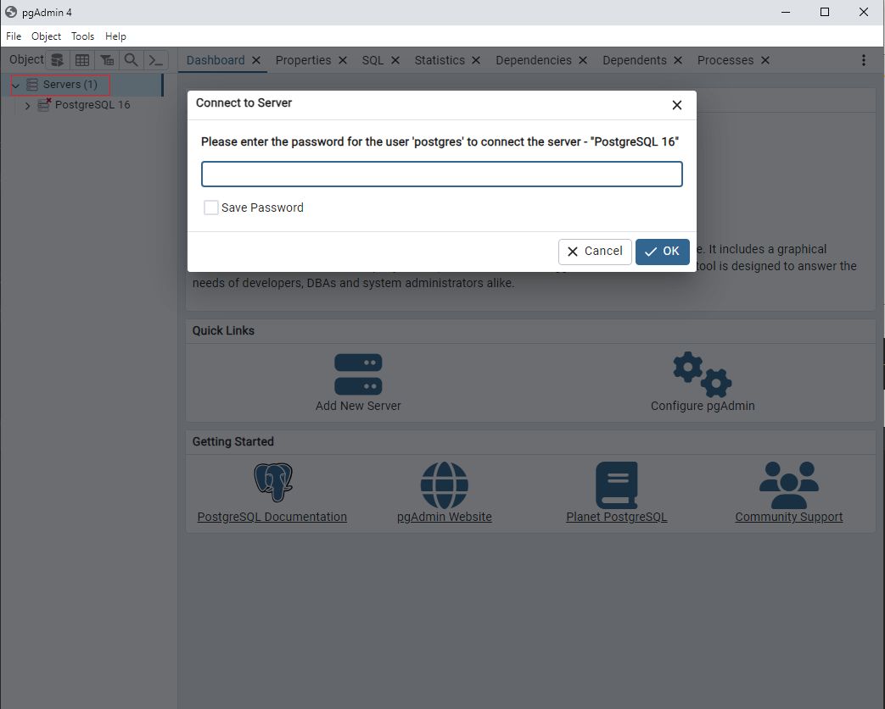

Видим, что по умолчанию создана таблица `postgres` и пользователь `postgres`

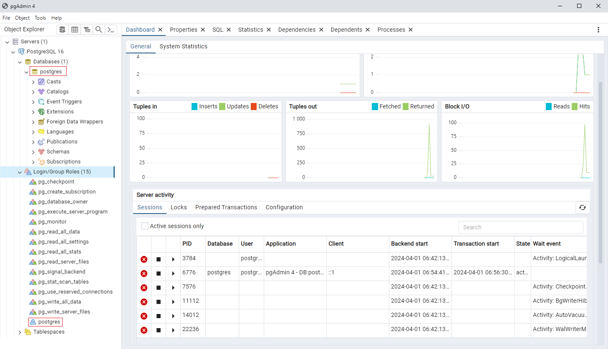

Чтобы создать новую базу данных, можно использовать наработки на курсе баз данных и создать используя Dbeaver, а можно используя данную админ панель,
чем и воспользуемся.

Для создания новой БД нажмите правой кнопкой мыши на Databases

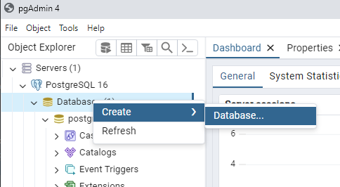

Придумайте название БД и кто будет владельцем это БД


Действия можно совершать не только в админ панели, но и в специальной консоли SQL Shell.

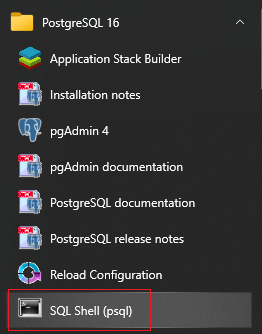

Зайдите в консоль 4 раза нажмите Enter на клавиатуре, так как 4 раза будет значение по умолчанию. На пароле введите пароль
от вашего админа. `Учтите, пароль не отображается на экране!`

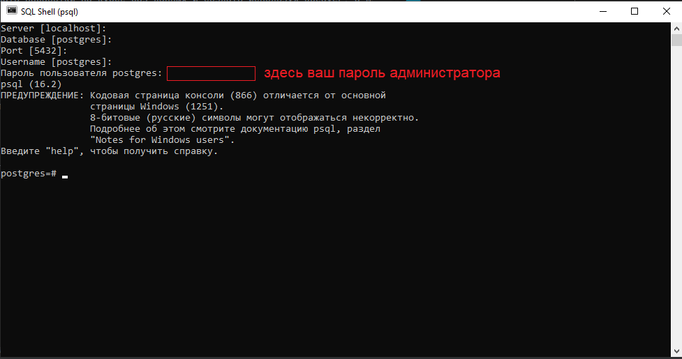

и создайте там БД.

```python
create database my_database_1;
```

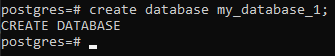

В админ панели она не появилась, нужно обновить отображение баз данных, через правую кнопку мыши на `Databases`

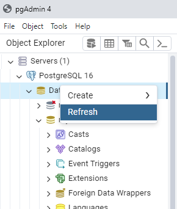

Подключимся к нашей БД через DBeaver

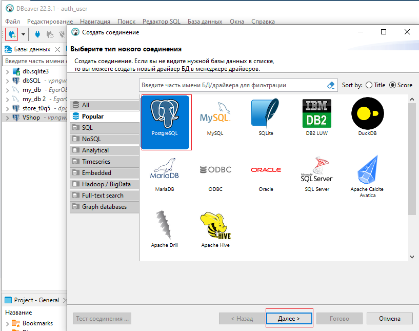

Введите данные

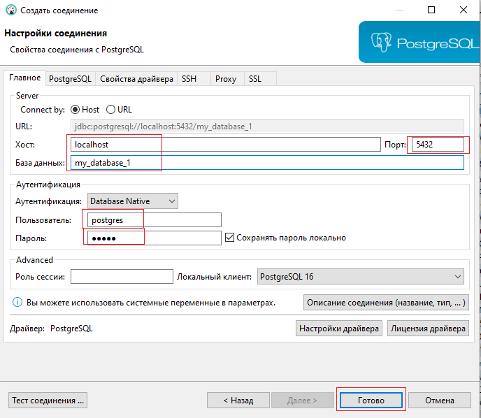

Теперь можете работать через Dbeaver

Перенос данных осуществляется аналогично как при переносе данных в Postgre на сервер. Сначала прописываем БД в `settings.py`. Затем применяем миграции `migrate`. И наконец переносим наполнение `loaddata`.


## 2. Через бинарные [файлы](https://www.enterprisedb.com/download-postgresql-binaries).

Как написано для опытных пользователей (на самом деле более сложный способ, чем способ выше).

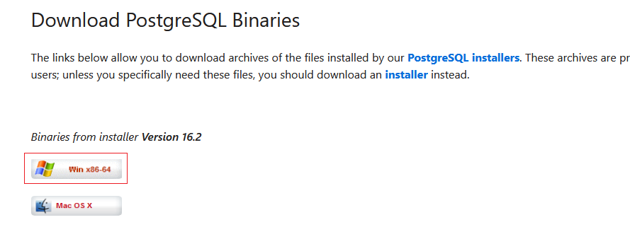

Если выполнили простую установку и желаете рассмотреть и второй способ, то рекомендуется удалить программу PostgreSQL, 
чтобы приложения не конфликтовали друг с другом.

