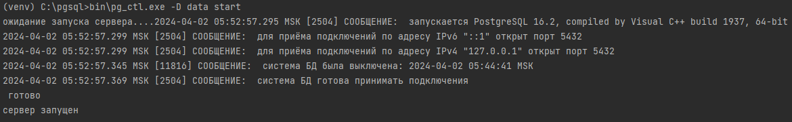
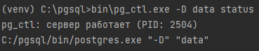
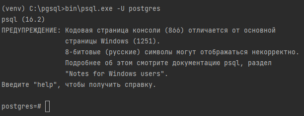
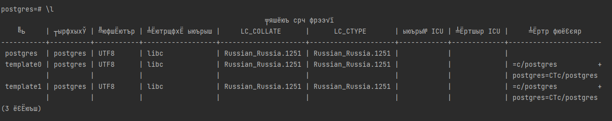
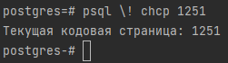
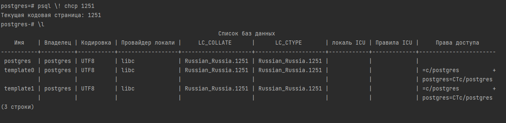
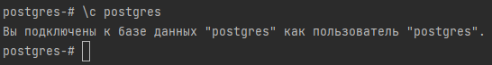
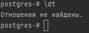
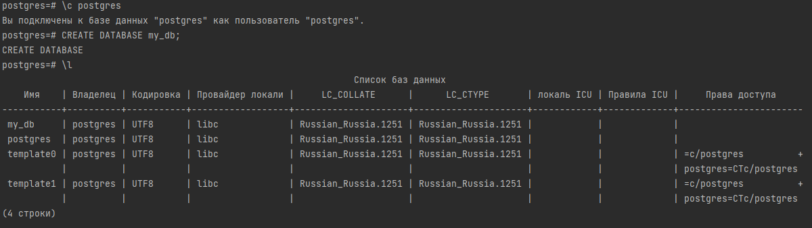
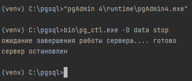

Здесь будет рассмотрено 2 подхода:

1. Создание БД PostgreSQL на отдельном сервисе (для тех у кого нет возможности локально развернуть БД)

> Для примера рассмотрим сервис render.com

> Можете пройти по [руководству](https://docs.google.com/document/d/1AZAQSEcPhRBPNRxMIKSxN0_4TF4AlOG0kMxEP1e3CTM/edit#heading=h.85bc4nbl9ubi) из немного другого приложения (основные действия те же)
для создания и подключения через render.com.

2. Создание локальной базы данных Postgre на вашем компьютере.

На официальном сайте [Postgre](https://www.postgresql.org/download/) поддерживается большое количество операционных систем. Далее будет рассмотрена
установка и настройка на `ОС Windows`

Есть 2 способа установки:

## 1. Упрощенный через установщик

Скачайте [инсталятор](https://www.enterprisedb.com/downloads/postgres-postgresql-downloads)


При установке таким методом сложности возникнуть не должно

На одном из этапов будет предложено создать админа. Придумайте username и password для него.


Порт можете оставить по умолчанию


Можно выбрать локализацию или оставить по умолчанию


После база данных установится. 

Установщик пакетов можно закрыть.


Особенность установки через инсталятор, это то, что создаётся автозапуск БД при старте системы, 
так что её не нужно запускать самостоятельно, что упрощает работу.

Теперь у нас есть БД Postgre, и к ней можно подключиться. Но перед этим зайдем в приложение `pgAdmin4`


Зайдем под паролем админа (тем что создавали при установке) в админ панель


Видим, что по умолчанию создана таблица `postgres` и пользователь `postgres`


Чтобы создать новую базу данных, можно использовать наработки на курсе баз данных и создать используя Dbeaver, а можно используя данную админ панель,
чем и воспользуемся.

Для создания новой БД нажмите правой кнопкой мыши на Databases


Придумайте название БД и кто будет владельцем это БД


Действия можно совершать не только в админ панели, но и в специальной консоли SQL Shell.


Зайдите в консоль 4 раза нажмите Enter на клавиатуре, так как 4 раза будет значение по умолчанию. На пароле введите пароль
от вашего админа. `Учтите, пароль не отображается на экране!`


и создайте там БД.

```python
create database my_database_1;
```


В админ панели она не появилась, нужно обновить отображение баз данных, через правую кнопку мыши на `Databases`


Подключимся к нашей БД через DBeaver


Введите данные


Теперь можете работать через Dbeaver

Перенос данных осуществляется аналогично как при переносе данных в Postgre на сервер. Сначала прописываем БД в `settings.py`. Затем применяем миграции `migrate`. И наконец переносим наполнение `loaddata`.


## 2. Через бинарные файлы.

На сайте написано для опытных пользователей (так как придётся работать через консоль, но самый универсальный способ).

Скачайте [архив](https://www.enterprisedb.com/download-postgresql-binaries).


Если выполнили установку первым способом ("Упрощенный через установщик") и желаете рассмотреть и второй способ, то рекомендуется удалить программу PostgreSQL, 
чтобы приложения не конфликтовали друг с другом.

Распакуйте архив в удобное место (распакованный архив весит примерно 1 ГБ, может распаковываться значительное время), 
так как само хранилище будет в данной папке.

Затем выполняем следующее:

1. Зайдите в консоль, можно через системную (cmd, powershell, ...) или терминал PyCharm. Перейдите в папку с вашей БД. 
Для этого найдите место где вы её распаковали и при помощи команды `cd` перейдите в эту директорию. В моём случае папка с БД лежит по адресу
`C:\pgsql`

```cmd
cd C:\pgsql
```

2. `Инициализация кластера данных`. Перейдите в каталог, в который вы распаковали архив с бинарными файлами PostgreSQL, 
и выполните инициализацию кластера данных. Для этого используйте команду `initdb`

```cmd
bin\initdb.exe --username=postgres --pwprompt -E UTF8 -D data
```

По требованию введите пароль и повторите его.

Команда `initdb.exe` используется для инициализации кластера данных PostgreSQL. 

Вот что делает каждый аргумент этой команды:

* `--username=postgres`: Этот аргумент указывает, что пользователь PostgreSQL, от имени которого будет выполняться инициализация кластера данных, должен быть postgres. Это означает, что учетная запись postgres будет использоваться для выполнения административных задач.


* `--pwprompt`: Этот аргумент заставляет initdb.exe запросить пароль для пользователя PostgreSQL (в данном случае postgres). После ввода пароля он будет использоваться для защиты кластера данных.


* `-E UTF8`: Этот аргумент устанавливает кодировку базы данных в UTF-8. UTF-8 является распространенной и рекомендуемой кодировкой для баз данных PostgreSQL, поскольку она поддерживает широкий спектр символов.


* `-D data`: Этот аргумент указывает путь к директории, в которой будет создан кластер данных PostgreSQL. В данном случае, data - это имя каталога (или путь к каталогу), где будут храниться файлы и данные кластера PostgreSQL.


3. `Запуск сервера`: После инициализации кластера данных, вы можете запустить сервер PostgreSQL с помощью команды `pg_ctl start`

```cmd
bin\pg_ctl.exe -D data start
```



4. `Проверка статуса сервера`: После запуска сервера вы можете проверить его статус с помощью команды `pg_ctl status`


```cmd
bin\pg_ctl.exe -D data status
```




5. `Откроем консоль Postgre`: Зайдем в терминал под администратором (postgres)

```cmd
bin\psql.exe -U postgres
```



6. `Посмотрим всех доступных баз`: Для этого воспользуемся командой \l

```cmd
\l
```


Так как для Windows было предупреждение, что может быть неправильная кодировка, то сменим её (ещё варианты смены можно посмотреть [здесь](https://iu5bmstu.ru/index.php/PostgreSQL_-_%D0%9A%D0%B8%D1%80%D0%B8%D0%BB%D0%BB%D0%B8%D1%86%D0%B0_%D0%B2_psql_%D0%BF%D0%BE%D0%B4_Windows))

```cmd
psql \! chcp 1251
```



Теперь в консоли кириллица отображается верно, можно снова выполнить `\l`




6. Подключимся к конкретной базе, в нашем случае `postgres`, для этого воспользуемся командой `\c database_name`, где  
`database_name` - название баз данных, в нашем случае `postgres`

```cmd
\c postgres
```



7. Выведем список всех таблиц в текущей базе, при помощи команды `\dt`. Так как база пустая, то таблиц не будет

```cmd
\dt
```




8. Создадим новую БД. Для этого вновь перейдём под базу postgres

```cmd
\c postgres
```

И уже затем создадим новую БД

```cmd
CREATE DATABASE my_db;
```

И отобразим, что база создалась

```cmd
\l
```




9. Выйдем из консоли postgres введя команду `\q` (или используйте сочетание клавиш `Ctrl + D` (для Unix-подобных систем) 
или `Ctrl + Z` (для Windows) и затем нажмите `Enter`)

```cmd
\q
```

10. Даже если скачивали файл архивом, то внутри всё равно есть клиент pgAdmin4, который можно вызвать командой 

```cmd
"pgAdmin 4\runtime\pgAdmin4.exe"
```

Или найти файл exe по соответствующему пути.

11. `Остановка сервера`: Для остановки сервера PostgreSQL используйте команду `pg_ctl stop`

```cmd
bin\pg_ctl.exe -D data stop
```



Были рассмотрены основные команды, если необходимо заново запустить сервер postgre, то выполните шаг 3.