# Оглавление

* [1.Работа с API, через view](#section-1)
  * [1.1 GET запрос](#section-1_1)
    * [1.1.1 requests](#section-1_1_1)
    * [1.1.2 curl](#section-1_1_2)
    * [1.1.3 postman](#section-1_1_3)
  * [1.2 POST запрос](#section-1_2)
    * [1.2.1 requests](#section-1_2_1)
    * [1.2.2 curl](#section-1_2_2)
    * [1.2.3 postman](#section-1_2_3)
  * [1.3 PUT запрос](#section-1_3)
    * [1.3.1 requests](#section-1_3_1)
    * [1.3.2 curl](#section-1_3_2)
    * [1.3.3 postman](#section-1_3_3)
  * [1.4 PATCH запрос](#section-1_4)
    * [1.4.1 requests](#section-1_4_1)
    * [1.4.2 curl](#section-1_4_2)
    * [1.4.3 postman](#section-1_4_3)
  * [1.5 DELETE запрос](#section-1_5)
    * [1.5.1 requests](#section-1_5_1)
    * [1.5.2 curl](#section-1_5_2)
    * [1.5.3 postman](#section-1_5_3)
  * [1.6 Типовые возвращаемые статус коды и что они значат (материал для чтения)](#section-1_6)
  * [1.7 Самостоятельно (для желающих)](#section-1_7)
* [2 Работа с API через Django REST Framework](#section-2)
  * [2.1 Начало работы с DRF](#section-2_1)
  * [2.2 Алгоритм создания точки доступа к API](#section-2_2)
    * [2.2.1 Создание сериализатора](#section-2_2_1)
    * [2.2.2 Создание представления](#section-2_2_2)
    * [2.2.3 Настройка маршрутизации (URL Routing)](#section-2_2_3)
  * [2.3 Проверка маршрутов](#section-2_3)
  * [2.4 Сериализатор модели](#section-2_4)
* [Необязательный блок](#section-optional-block)

___

# <a name="section-1"></a> 1. Работа с API, через view

Перед тем как работать с `Django Rest Framework` сначала посмотрим как бы можно было сделать
решение задачи доступа к ресурсам через методы `GET`, `POST`, `PUT`, `PATCH`, `DELETE`, без него.

В приложении `db_train_alternative` во `views.py` пропишем пару отображений для работы с данными.

Создадим возможность работы с БД (отображения, изменения) таблиц приложения `db_train_alternative`

Поработаем над таблицей Author, там всего 2 поля `name` и `email` особых сложностей не должно быть.

## <a name="section-1_1"></a> 1.1 GET запрос

Во `views.py` приложения `db_train_alternative` создадим отображение `AuthorREST` возвращающее json,
пропишем пока только GET запрос. Поработаем над базовым классом `View`, чтобы всё прописать руками.

Скопируйте во `views.py` и проанализируйте данный код. Здесь мы по принципу REST сформировали get запрос, т.е.
есть возможность как получить все данные из БД, так как и какие-то конкретные. После получения данных мы определяем какие
данные (поля таблицы) будут возвращаться. Если не нашли конкретного автора, то возвращаем JSON с кодом 404 и поясняющим сообщением.

```python
from django.http import JsonResponse
from django.views import View
from .models import Author
from django.views.decorators.csrf import csrf_exempt
import json


class AuthorREST(View):
    def get(self, request, id=None):

        if id is None:  # Проверяем, что требуется вернуть всех пользователей
            data = []
            for author in Author.objects.all():
                # Производим сериализацию, т.е. определяем, что именно запишется в данные для преобразования в JSON
                data_author = {'id': author.id,
                               'name': author.name,
                               'email': author.email}
                data.append(data_author)
        else:
            author = Author.objects.filter(id=id)
            if author:  # Если автор такой есть, т.е. QuerySet не пустой
                author = author.first()  # Получаем первого автора из QuerySet, так как он там один
                # Производим сериализацию, т.е. определяем, что именно запишется в данные для преобразования в JSON
                data = {'id': author.id,
                        'name': author.name,
                        'email': author.email}
            else:  # Иначе, так как автор не найден (QuerySet пустой), то возвращаем ошибку, с произвольным текстом,
                # для понимания почему произошла ошибка
                return JsonResponse({'error': f'Автора с id={id} не найдено!'},
                                    status=404,
                                    json_dumps_params={"ensure_ascii": False,
                                                       "indent": 4}
                                    )

        # После того как данные для ответа созданы - возвращаем Json объект с данными
        return JsonResponse(data, safe=False, json_dumps_params={"ensure_ascii": False,
                                                                 "indent": 4})
```

Создайте файл `urls.py` в данном приложении и опишите там пути. Опять же архитектурный стиль REST, одно отображение, но благодаря
разным методам получаются разные действия.

```python
from django.urls import path
from .views import AuthorREST


urlpatterns = [
    path('author/', AuthorREST.as_view()),
    path('author/<int:id>/', AuthorREST.as_view()),
]
```
Затем добавляем ссылку на приложение в `urls.py` в папке `project`

```python
urlpatterns = [
    # ...
    path('api_alter/', include('apps.db_train_alternative.urls')),
]
```

Проверьте работоспособность данного отображения по путям

---
Чтобы вывести всех авторов

http://127.0.0.1:8000/api_alter/author/

---
Чтобы вывести автора с id=10

http://127.0.0.1:8000/api_alter/author/10/

---
Чтобы вывести несуществующего автора

http://127.0.0.1:8000/api_alter/author/0/

---

Формально вот мы и создали свой API endpoint (точку присоединения), чтобы получать нужную нам информацию при GET запросе по адресу
`http://127.0.0.1:8000/api_alter/author/`

Туже информацию мы можем получить через `requests` в python или через `curl`.

Напомним как это делается.

### <a name="section-1_1_1"></a> 1.1.1 requests

Для работы с `requests` воспользуемся `Python Console`, где пропишем

```python
import requests
response = requests.get('http://127.0.0.1:8000/api_alter/author/')
response.status_code
response.json()
```

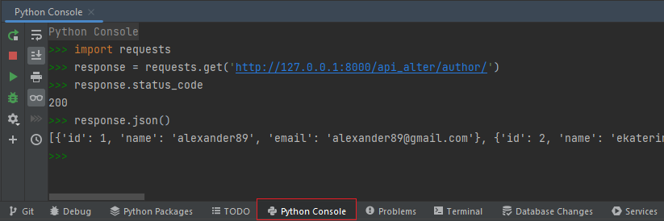

### <a name="section-1_1_2"></a> 1.1.2 curl

Теперь в терминале (`Terminal`) обратимся к тому же адресу, но через `curl`

```text
curl http://127.0.0.1:8000/api_alter/author/
```

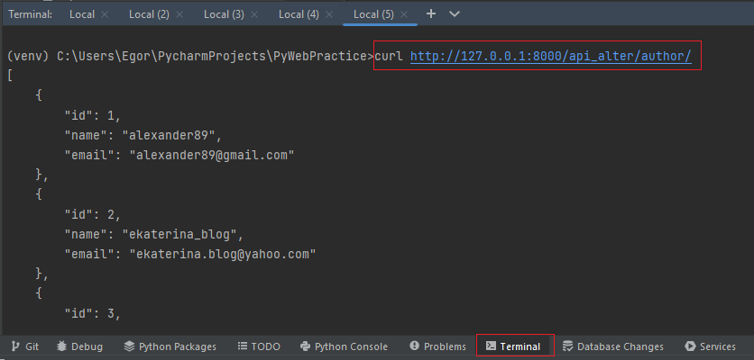

### <a name="section-1_1_3"></a> 1.1.3 postman

Также можно использовать специальные программы на примере Postman, которые позволяют проводить проверку работоспособности
API и её endpoints. 

Скачайте и установите программу [Postman](https://www.postman.com/downloads/) (если вы находитесь в классе ВИШ, то спросите у преподавателя,
где находится файл установки на компьютере). Нужна именно версия на компьютере, а не web версия, так как web версия не позволяет
обрабатывать запросы на localhost.

Зарегистрируйтесь или нажмите на использование легковесного клиента(при использовании легковесного клиента ваши запросы не сохранятся
на сервере Postman, что может быть не так удобно при использовании программы на другом компьютере)

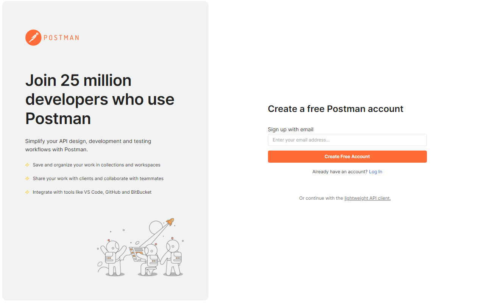

Создадим коллекцию, это своего рода папка с запросами на одну тему

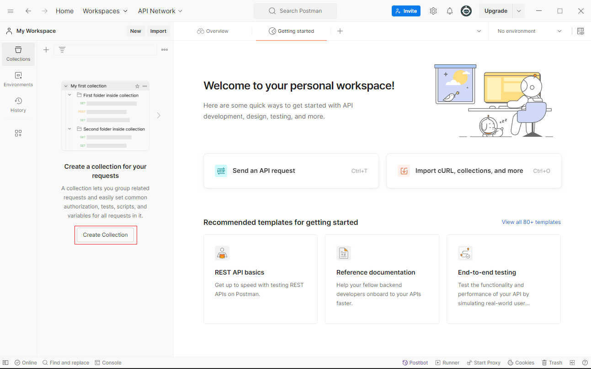

Назовем нашу коллекцию, допустим `Тестирование db_alternative`

Теперь добавим запросов в нашу коллекцию

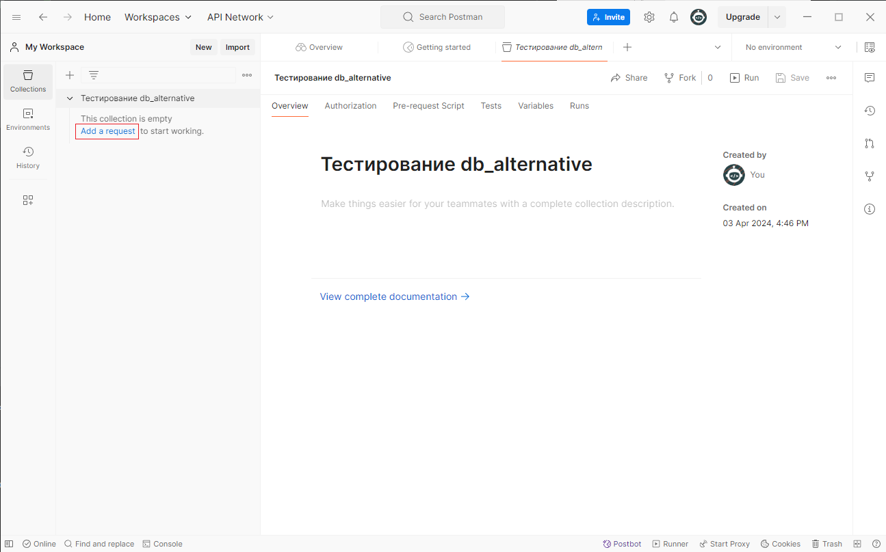

Назовем наш запрос, допустим `Get Authors` так как планируем создать GET запрос к таблице Author

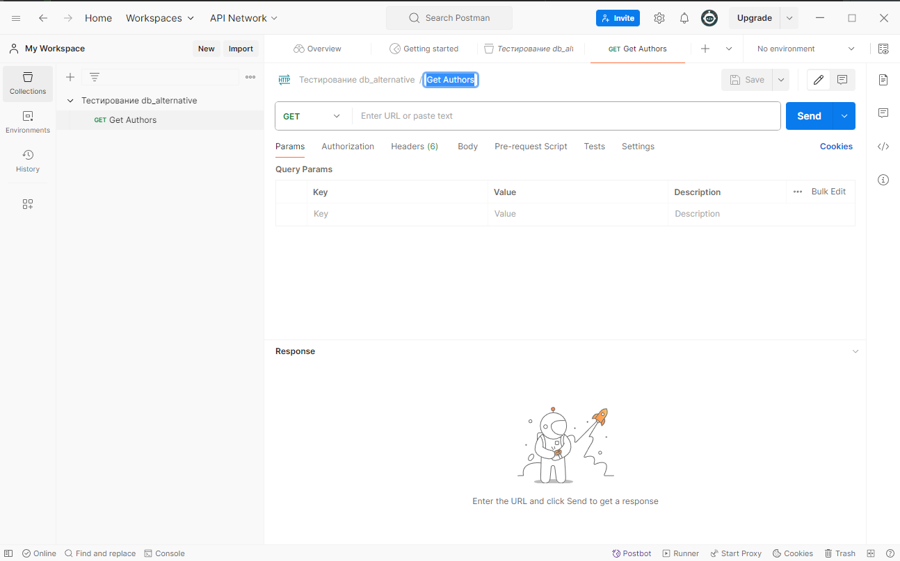

И в форме прописываем адрес для запроса и нажимаем `Send`

```text
http://127.0.0.1:8000/api_alter/author/
```

В форме ниже получаем результат. Можно сохранить данный запрос, чтобы не нужно было его заново вводить

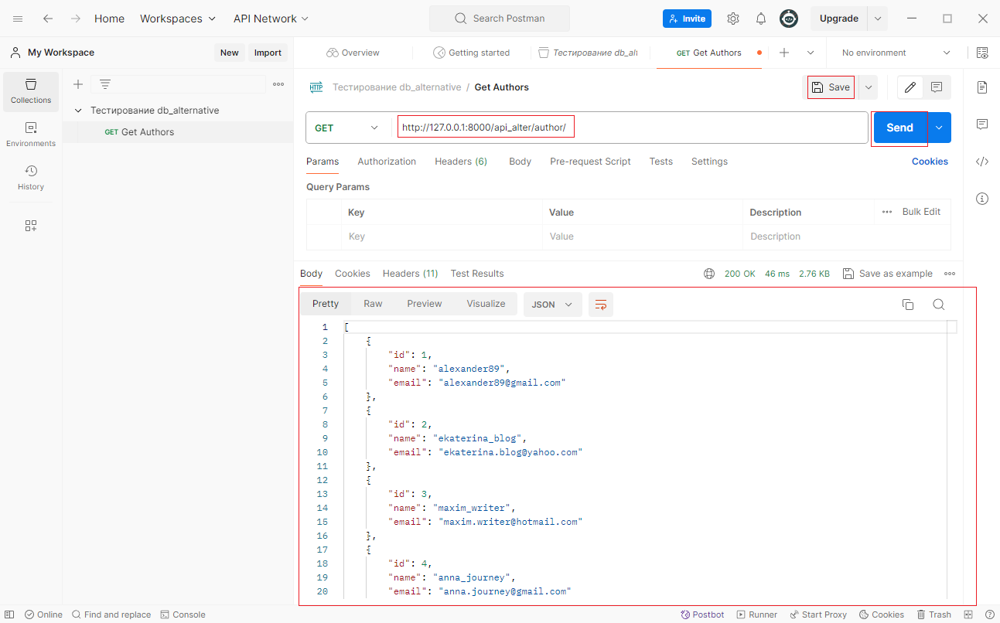

Postman позволяет удобно работать с группами запросов и удобно тестировать их.

## <a name="section-1_2"></a> 1.2 POST запрос

Настало время передать информацию и создать нового автора в REST стиле, для этого в `AuthorREST` добавим метод `post`

```python
class AuthorREST(View):
    def get(self, request):
        # код что был
    
    def post(self, request):
        try:
            data = json.loads(request.body)
            author = Author.objects.create(name=data['name'], email=data['email'])
            response_data = {
                'message': f'Автор успешно создан',
                'id': author.id,
                'name': author.name,
                'email': author.email
            }
            return JsonResponse(response_data, status=201,
                            json_dumps_params={"ensure_ascii": False,
                                              "indent": 4}
                            )
        except Exception as e:
            return JsonResponse({'error': str(e)}, status=400,
                                json_dumps_params={"ensure_ascii": False,
                                                  "indent": 4}
                                )
```

Новую маршрутизацию проводить не нужно, так как о добавлении данных Django понимает из метода запроса POST, мы же о 
REST принципе говорим.

Теперь проверим как работает новый метод `post`

Вручную через адресную строку не проверить `post` запрос, поэтому посмотрим так как умеем

### <a name="section-1_2_1"></a> 1.2.1 requests

Сначала с библиотекой `requests` в `PythonConsole`

```python
import requests
import json
data = {'name': 'user123', 'email': 'user123'}
url = 'http://127.0.0.1:8000/api_alter/author/'
response = requests.post(url=url, data=json.dumps(data))
response.status_code
```

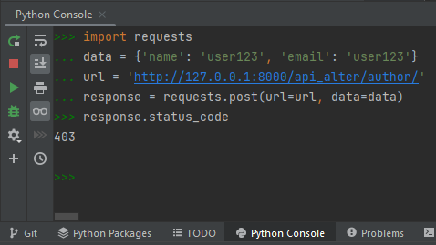

Получили ошибку 403, связанную с тем, что Django любые небезопасные запросы (те, что что-то меняют, допустим POST, PUT, DELETE)
не пропускает без csrf токена, для упрощения разработки это временно можно отключить, используя декоратор `@csrf_exempt` над методом `dispatch`
мы отключим обязательное требование этого механизма.

```python
class AuthorREST(View):
    @csrf_exempt
    def dispatch(self, *args, **kwargs):
        return super().dispatch(*args, **kwargs)
    
    def get(self, request):
        # код что был
    
    def post(self, request):
        # код что был
```

Метод `dispatch` в Django-представлениях обрабатывает запросы, направляя их к соответствующим методам обработки (например, GET, POST, PUT, DELETE). 
Он является частью механизма маршрутизации и обработки запросов в Django.

По умолчанию `dispatch` определяет, какой метод (GET, POST, PUT, DELETE и т. д.) использовать для обработки входящего запроса. 
Он делает это на основе HTTP-метода, используемого в запросе. Например, если приходит запрос типа GET, то `dispatch` вызывает метод `get`. 
Если приходит запрос типа POST, то он вызывает метод `post`, и так далее.

В примере выше `csrf_exempt` используется для временного отключения защиты CSRF (Cross-Site Request Forgery) для данного представления. 
Это делается потому, что мы принимаем данные без проверки CSRF в методах post, put и delete. 
В реальном приложении необходимо активировать CSRF-защиту, но для этого примера она временно отключена для упрощения.

```python
import requests
import json
data = {'name': 'user123', 'email': 'user123'}
url = 'http://127.0.0.1:8000/api_alter/author/'
response = requests.post(url=url, data=json.dumps(data))
response.status_code
response.json()
```

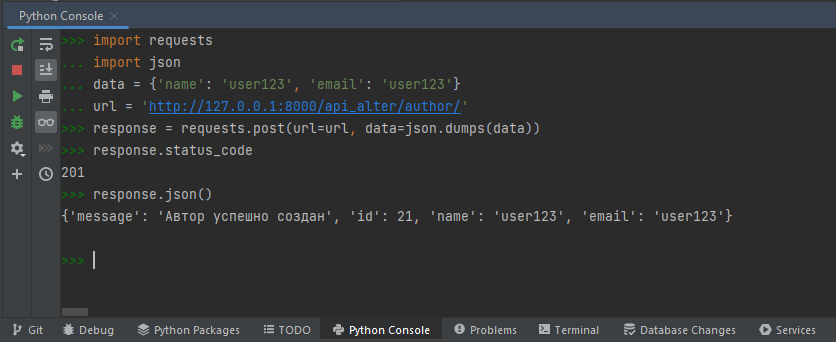

Теперь всё успешно создано, даже в БД есть запись, но вот странно, пользователь создался, но email даже не валидировался,
так как в БД теперь пользователь с email `user123`. Это связано с тем, что Django ORM по умолчанию для ускорения записи в БД
не проводит валидацию и оставляет право за разработчиком проверить поля модели самостоятельно, если это необходимо, чтобы вызвать проверку
полей (валидация) необходимо перед сохранением объекта вызвать `clean_fields()`

Удалите через админ панель созданного автора в таблице `Авторы` приложения `Db_Train_Alternative`

Затем заменить код в методе `post` на следующий (обратите внимание создание через `create` было заменено на 2 строки
объявление объекта author и вызов проверок, так как `create` не имеет `clean_fields()`):

```python
def post(self, request):
    try:
        data = json.loads(request.body)
        
        author = Author(name=data['name'], email=data['email'])
        author.clean_fields()  # Запуск валидаций
        author.save()  # Сохранение в БД
        
        response_data = {
            'message': f'Автор успешно создан',
            'id': author.id,
            'name': author.name,
            'email': author.email
        }
        return JsonResponse(response_data, status=201,
                            json_dumps_params={"ensure_ascii": False,
                                              "indent": 4}
                            )
    except Exception as e:
        return JsonResponse({'error': str(e)}, status=400,
                            json_dumps_params={"ensure_ascii": False,
                                              "indent": 4}
                            )
```

А теперь повторяем код в `PythonConsole`

```python
import requests
import json
data = {'name': 'user123', 'email': 'user123'}
url = 'http://127.0.0.1:8000/api_alter/author/'
response = requests.post(url=url, data=json.dumps(data))
response.status_code
response.json()
```

И видим то, что хотели бы увидеть, ошибку, что email не валиден

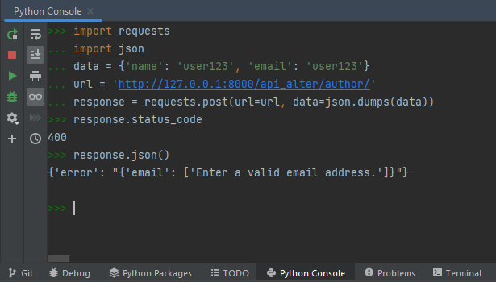

### <a name="section-1_2_2"></a> 1.2.2 curl

Теперь в терминале (`Terminal`) обратимся к тому же адресу, но через `curl`

```text
curl -X POST http://127.0.0.1:8000/api_alter/author/ -H "Content-Type: application/json" -d "{\"name\": \"user123\", \"email\": \"user123@user.com\"}"
```

В этой команде использовано экранирование обратными слэшами (\) для обеспечения правильного формата JSON

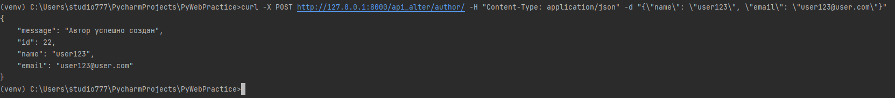

### <a name="section-1_2_3"></a> 1.2.3 postman

Нажимаем на + и создаём новый запрос

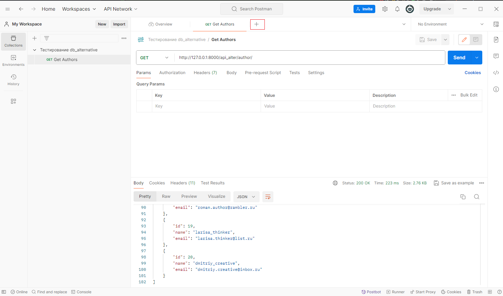

Вводим адрес

```text
http://127.0.0.1:8000/api_alter/author/
```

выбираем POST

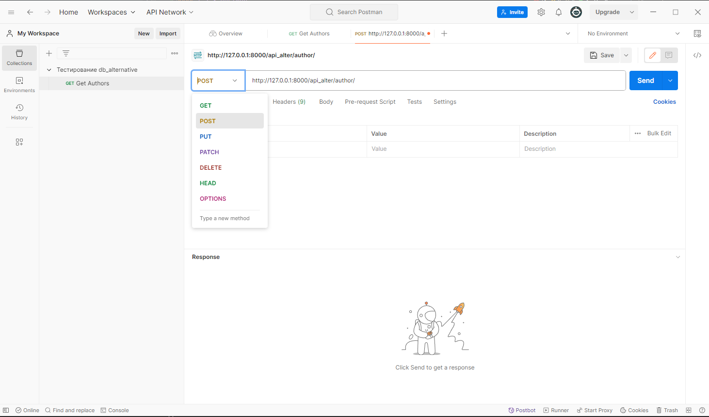

Далее необходимо прописать в заголовке, что мы отправляем JSON, для этого в `Headers` пропишем

| Key          | Value            |
|--------------|------------------|
| Content-Type | application/json |

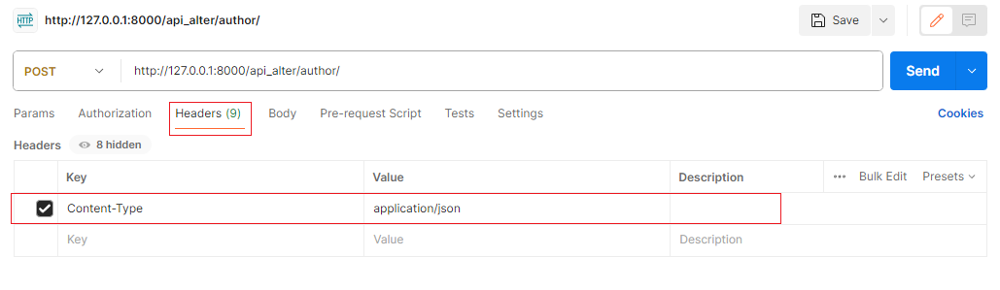

Далее переходим в `Body` выбираем `raw` (обратите внимание, чтобы сбоку стояло JSON) и прописываем там данные для отправки

```text
{
    "name": "user1",
    "email": "user1@user.com"
}
```

Затем нажимаем `Send`

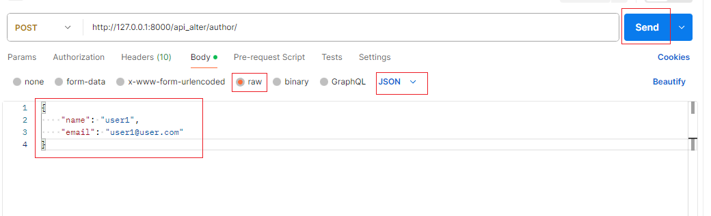

И получаем ответ

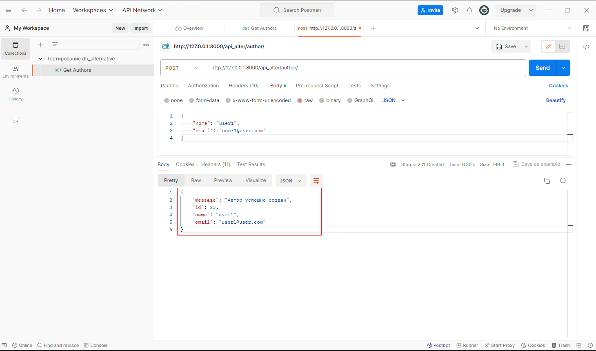

Осталось только сохранить данный запрос, для этого нажимаем на Save

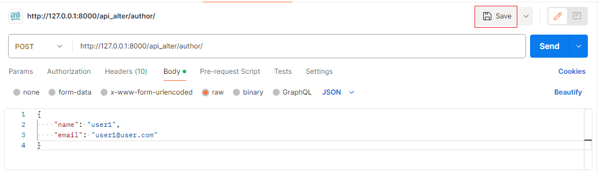
 
В поле `Request Name` прописываем название запроса `Post Author` и сохраняем на Save

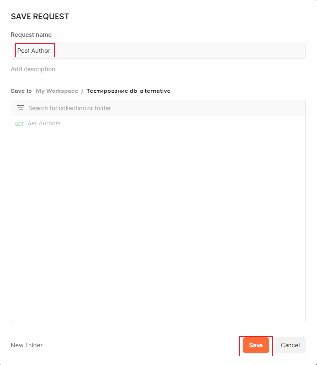

## <a name="section-1_3"></a> 1.3 PUT запрос

Далее пропишем возможность изменять данные об авторе при помощи `put` метода

```python
class AuthorREST(View):
    @csrf_exempt
    def dispatch(self, *args, **kwargs):
        # ...

    def get(self, request, id=None):
        # ...
       
    def post(self, request):
        # ...

    def put(self, request, id):
        try:
            author = Author.objects.get(id=id)
            data = json.loads(request.body)
            # Обновляем поля
            author.name = data['name']
            author.email = data['email']
            author.clean_fields()  # Запуск валидаций
            author.save()  # Сохранение в БД
            
            response_data = {
                'message': f'Данные автора успешно изменены',
                'id': author.id,
                'name': author.name,
                'email': author.email
            }
            return JsonResponse(response_data,
                                json_dumps_params={"ensure_ascii": False,
                                                   "indent": 4},
                                )
        except Author.DoesNotExist:  # Если получили ошибку
            return JsonResponse({'error': 'Автор не найден'},
                                status=404,
                                json_dumps_params={"ensure_ascii": False,
                                                   "indent": 4},
                                )
        except Exception as e:  # При любой другой ошибке
            return JsonResponse({'error': str(e)},
                                status=400,
                                json_dumps_params={"ensure_ascii": False,
                                                   "indent": 4},
                                )
```

## <a name="section-1_3_1"></a> 1.3.1 requests

Проверим, что при изменении email пользователя на невалидный - произойдет ошибка

В `PythonConsole` пропишем

```python
import requests
import json
data = {'name': 'user123', 'email': 'user123'}
url = 'http://127.0.0.1:8000/api_alter/author/22/'
response = requests.put(url=url, data=json.dumps(data))
response.status_code
response.json()
```

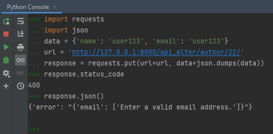

А если прописать нормально, то все поменяется

```python
import requests
import json
data = {'name': 'user12', 'email': 'user12@user.com'}
url = 'http://127.0.0.1:8000/api_alter/author/22/'
response = requests.put(url=url, data=json.dumps(data))
response.status_code
response.json()
```

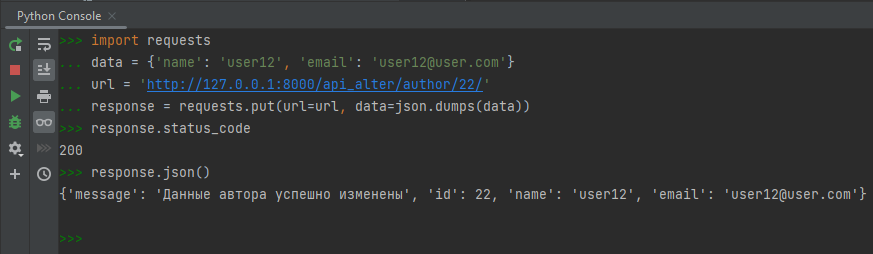

## <a name="section-1_3_2"></a> 1.3.2 curl

С curl аналогично

Теперь в терминале (`Terminal`) обратимся к тому же адресу, но через `curl`

```text
curl -X PUT http://127.0.0.1:8000/api_alter/author/22/ -H "Content-Type: application/json" -d "{\"name\": \"user123\", \"email\": \"user123@user.com\"}"
```

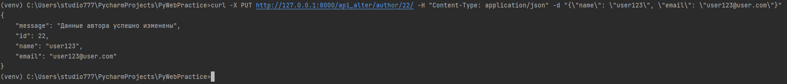

## <a name="section-1_3_3"></a> 1.3.3 postman

Для Postman теперь пропишем запросы для PUT, сделаем их несколько, для проверки как изменения, так и появления ошибок

Для этого создаём новый запрос нажав на `+`

---

По аналогии с POST делаем с PUT

Вводим адрес

```text
http://127.0.0.1:8000/api_alter/author/22/
```

выбираем PUT

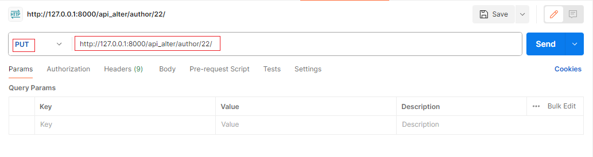

Далее необходимо прописать в заголовке, что мы отправляем JSON, для этого в `Headers` пропишем

| Key          | Value            |
|--------------|------------------|
| Content-Type | application/json |

Далее переходим в `Body` выбираем `raw` (обратите внимание, чтобы сбоку стояло JSON) и прописываем там данные для отправки

```text
{
    "name": "user1",
    "email": "user2@user.com"
}
```

Затем нажимаем `Send`

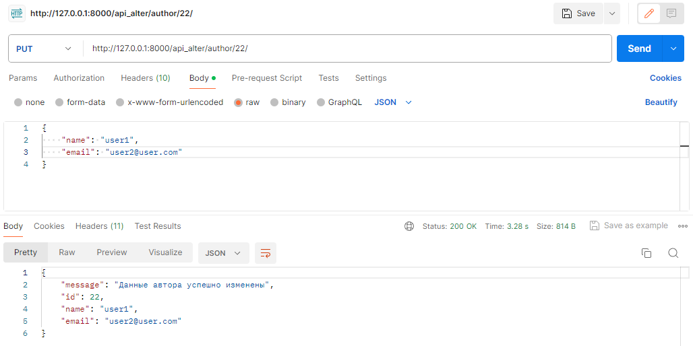

---

Сохраним данный запрос нажав на Save, напишем имя `Put Author Correct` и создадим отдельную папку `PUT`, чтобы сложить туда запросы PUT

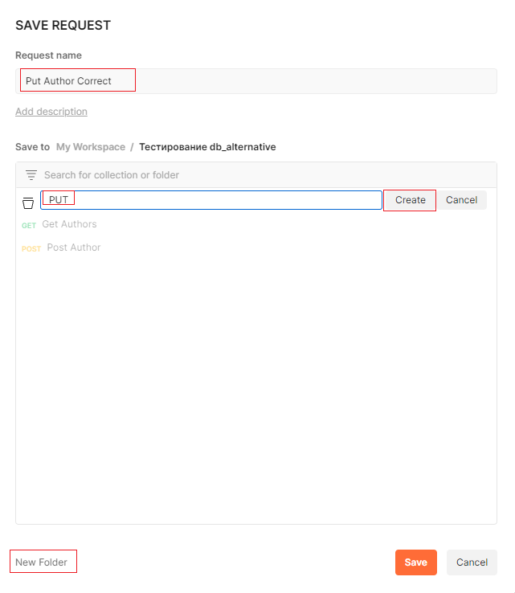

И сохраняем в данной папке

После сохранения появится следующая структура

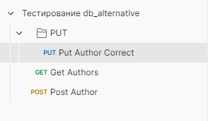

Теперь создадим ещё 2 PUT запроса, но с проверкой ошибок:

---
Проверка ошибки получения автора

Запрос на адрес  `http://127.0.0.1:8000/api_alter/author/0/`

В запрос не забудьте про заголовок в `Headers`

| Key          | Value            |
|--------------|------------------|
| Content-Type | application/json |

В `Body` в `raw` пропишите

```text
{
    "name": "user1",
    "email": "user2@user.com"
}
```

Выполните запрос

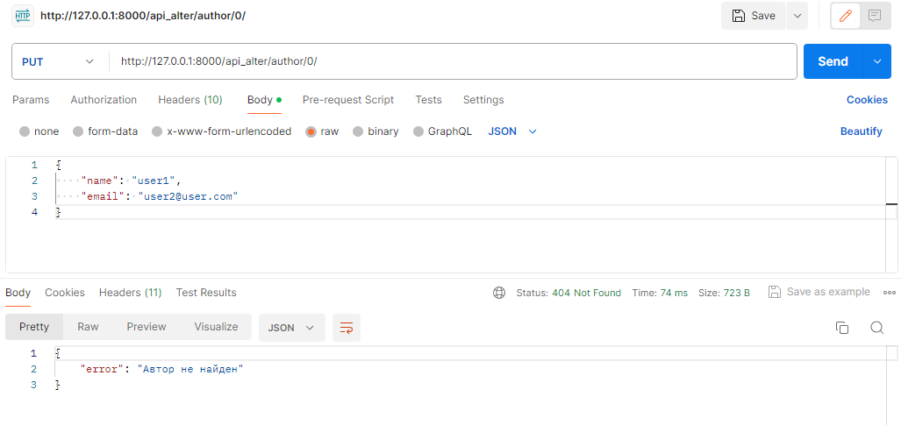

Сохраните запрос в папку PUT под названием `Put Author Incorrect`

---
Проверка получения ошибки валидации email

Запрос на адрес `http://127.0.0.1:8000/api_alter/author/22/`

В запрос не забудьте про заголовок в `Headers`

| Key          | Value            |
|--------------|------------------|
| Content-Type | application/json |

В `Body` в `raw` пропишите

```text
{
    "name": "user1",
    "email": "user2"
}
```

Выполните запрос

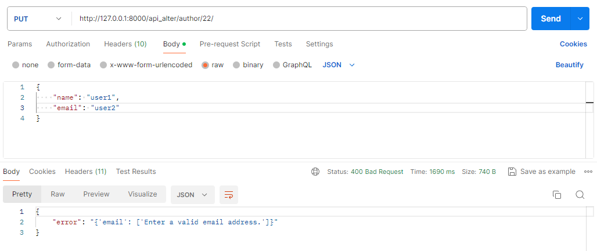

Сохраните запрос в папку PUT под названием `Put Author Incorrect Email`

---

Теперь структура будет выглядеть так

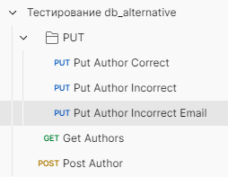


## <a name="section-1_4"></a> 1.4 PATCH запрос

Для частичного обновления данных используют метод `patch`

```python
class AuthorREST(View):
    @csrf_exempt
    def dispatch(self, *args, **kwargs):
        # ...

    def get(self, request, id=None):
        # ...
       
    def post(self, request):
        # ...

    def put(self, request, id):
        # ...
    
    def patch(self, request, id):
        try:
            author = Author.objects.get(id=id)  # Получаем объект
            data = json.loads(request.body)
    
            for key, value in data.items():  # Пробегаем по данным
                setattr(author, key, value)  # Устанавливаем соответствующие значения в поля
            author.clean_fields()  # Запуск валидаций
            author.save()  # Сохранение в БД
    
            response_data = {
                'id': author.id,
                'name': author.name,
                'email': author.email
            }
            return JsonResponse(response_data,
                                json_dumps_params={"ensure_ascii": False,
                                                   "indent": 4},
                                )
        except Author.DoesNotExist:
            return JsonResponse({'error': f'Автор с id={author.id} не найден'},
                                status=404,
                                json_dumps_params={"ensure_ascii": False,
                                                   "indent": 4},
                                )
        except Exception as e:
            return JsonResponse({'error': str(e)},
                                status=400,
                                json_dumps_params={"ensure_ascii": False,
                                                   "indent": 4},
                                )
    
```

## <a name="section-1_4_1"></a> 1.4.1 requests

В `PythonConsole` пропишем

```python
import requests
import json
data = {'name': 'superuser'}
url = 'http://127.0.0.1:8000/api_alter/author/22/'
response = requests.patch(url=url, data=json.dumps(data))
response.status_code
response.json()
```


## <a name="section-1_4_2"></a> 1.4.2 curl

Теперь в терминале (`Terminal`) обратимся к тому же адресу, но через `curl`

```text
curl -X PATCH http://127.0.0.1:8000/api_alter/author/22/ -H "Content-Type: application/json" -d "{\"name\": \"user123\"}"
```

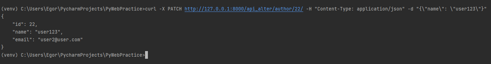

## <a name="section-1_4_3"></a> 1.4.3 postman

Метод `PATCH`

Запрос на адрес `http://127.0.0.1:8000/api_alter/author/22/`

В запрос не забудьте про заголовок в `Headers`

| Key          | Value            |
|--------------|------------------|
| Content-Type | application/json |

В `Body` в `raw` пропишите

```text
{
    "email": "user2000@user.com"
}
```

Выполните запрос

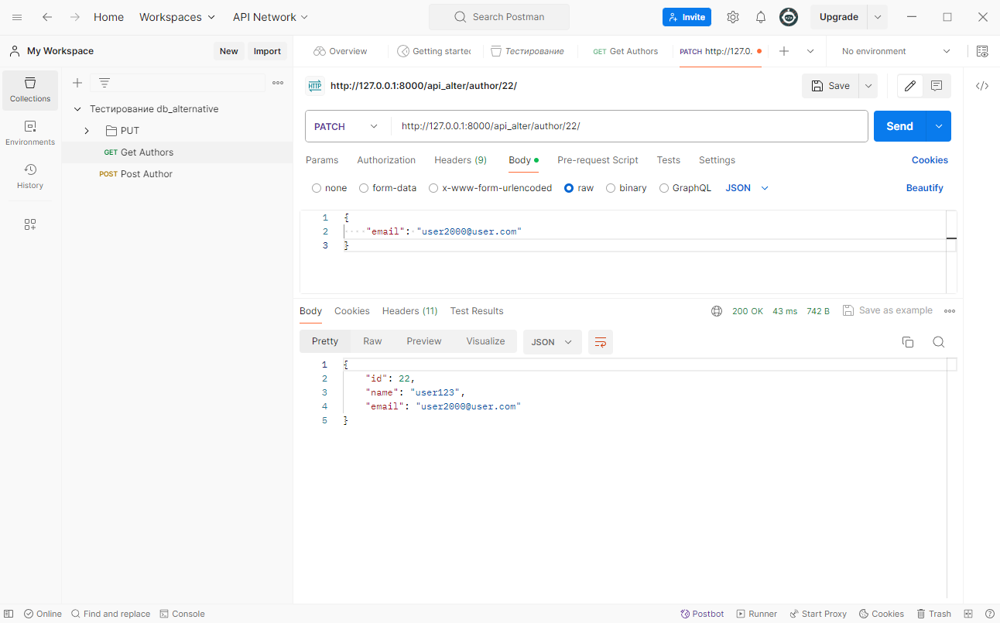

Сохраните запрос

## <a name="section-1_5"></a> 1.5 DELETE запрос

Для удаления данных используют метод `delete`


```python
class AuthorREST(View):
    @csrf_exempt
    def dispatch(self, *args, **kwargs):
        # ...

    def get(self, request, id=None):
        # ...
       
    def post(self, request):
        # ...

    def put(self, request, id):
        # ...
    
    def patch(self, request, id):
        # ...

    def delete(self, request, id):
        try:
            author = Author.objects.get(id=id)
            author.delete()
            return JsonResponse({'message': 'Автор успешно удалён'},
                                json_dumps_params={"ensure_ascii": False,
                                                   "indent": 4},
                                )
        except Author.DoesNotExist:
            return JsonResponse({'error': 'Автор не найден'},
                                status=404,
                                json_dumps_params={"ensure_ascii": False,
                                                   "indent": 4},
                                )
        except Exception as e:
            return JsonResponse({'error': str(e)},
                                status=400,
                                json_dumps_params={"ensure_ascii": False,
                                                   "indent": 4},
                                )
```


## <a name="section-1_5_1"></a> 1.5.1 requests

В `PythonConsole` пропишем

```python
import requests
url = 'http://127.0.0.1:8000/api_alter/author/23/'
response = requests.delete(url=url)
response.status_code
response.json()
```

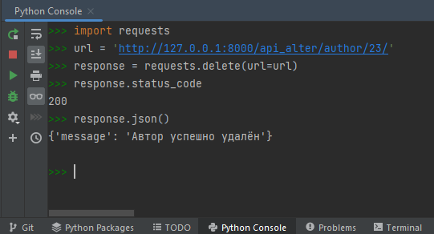

## <a name="section-1_5_2"></a> 1.5.2 curl

Теперь в терминале (`Terminal`) обратимся к тому же адресу, но через `curl`

```text
curl -X DELETE http://127.0.0.1:8000/api_alter/author/22/
```

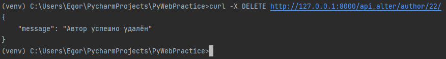

## <a name="section-1_5_3"></a> 1.5.3 postman

Метод `DELETE`

Запрос на неверный(такого автора нет, был удален ранее) адрес `http://127.0.0.1:8000/api_alter/author/22/`

Выполните запрос

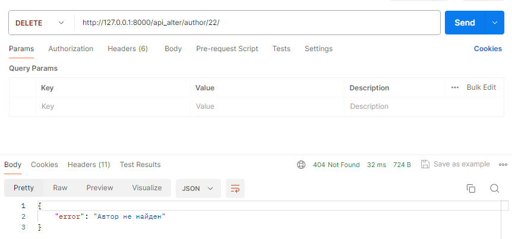

Сохраните запрос

## <a name="section-1_6"></a> 1.6 Типовые возвращаемые статус коды и что они значат (материал для чтения)

В RESTful API обычно используются стандартные HTTP-статусы для индикации успешного или неудачного выполнения операции. 

Вот общепринятые статусы для каждого метода запроса:

### <a name="section-1_6_1"></a> 1.6.1 GET

* Успешный запрос (Successful Request):
  * `200 OK`: Возвращается в случае успешного запроса, когда ресурс найден и возвращается в теле ответа.
* Неудача запроса (Unsuccessful Request):
  * `404 Not Found`: Возвращается, если запрашиваемый ресурс не найден.
  * `400 Bad Request`: Возвращается, если запрос содержит неверный синтаксис или некорректные параметры.

### <a name="section-1_6_2"></a> 1.6.2 POST

* Успешное создание (Successful Creation):
  * `201 Created`: Возвращается в случае успешного создания ресурса. Новый ресурс обычно создается и его URL возвращается в заголовке ответа Location.
* Неудачное создание (Unsuccessful Creation):
  * `400 Bad Request`: Возвращается, если запрос содержит неверный синтаксис или некорректные данные.
  * `409 Conflict`: Возвращается, если создание ресурса не удалось из-за конфликта (например, дублирование уникального ключа).

### <a name="section-1_6_3"></a> 1.6.3 PUT

* Успешное обновление (Successful Update):
  * `200 OK`: Возвращается в случае успешного обновления ресурса.
* Неудачное обновление (Unsuccessful Update):
  * `400 Bad Request`: Возвращается, если запрос содержит неверный синтаксис или некорректные данные.
  * `404 Not Found`: Возвращается, если запрашиваемый ресурс не найден.

### <a name="section-1_6_4"></a> 1.6.4 PATCH

* Успешное обновление (Successful Update):
  * `200 OK`: Возвращается в случае, когда обновление выполнено успешно и в ответе возвращается обновленный ресурс.
  * `204 No Content`: Возвращается, когда обновление выполнено успешно, но в ответе нет тела (пустое тело).
* Неудача обновления (Unsuccessful Update):
  * `400 Bad Request`: Возвращается, если запрос содержит неверный синтаксис или некорректные данные, которые не позволяют выполнить обновление.
  * `404 Not Found`: Возвращается, если запрашиваемый ресурс не найден и не может быть обновлен.
  * `409 Conflict`: Возвращается, если возникает конфликт при попытке обновления ресурса (например, конфликт версий или данные уже устарели).

### <a name="section-1_6_5"></a> 1.6.5 DELETE

* Успешное удаление (Successful Deletion):
  * `200 OK`: Возвращается в случае успешного удаления ресурса.
* Неудачное удаление (Unsuccessful Deletion):
  * `404 Not Found`: Возвращается, если запрашиваемый ресурс не найден.


### <a name="section-1_7"></a> 1.7 Самостоятельно (для желающих)

Самостоятельно определите таблицу в БД (из тех, что имеете), с которой будете работать и опишите часть методов вашего представления под REST принцип.
Настоятельно рекомендуется пока не брать Таблицы, где есть поля с файлами и картинками, так как загрузка файлов на сервер 
в API делается немного по-другому. Будет рассмотрено в дополнительных заданиях.

Протестируйте работоспособность вашего представления через Postman


# <a name="section-2"></a> 2. Работа с API через Django REST Framework

С пункта 1.1 до 1.5 было формирование представление возвращающее JSON, а пути обработки и методы были сделаны так, чтобы соответствовать
REST принципу. Вы видели насколько много необходимо прописать кода, чтобы сделать какие-то простейшие действия над данными в БД.

Чтобы облегчить жизнь в части создания точек подключения (endpoint) используется `Django REST Framework`.

## <a name="section-2_1"></a> 2.1 Начало работы с DRF

Установим Django restframework 

```python
pip install djangorestframework
```

Внесём изменения в `settings.py` и добавим `'rest_framework'` в установленные приложения `INSTALLED_APPS`

Если вы собираетесь использовать доступный для просмотра API, вы, вероятно, также захотите добавить представления входа в систему и выхода из системы REST. 
Добавьте следующее в корневой `urls.py` файл в папке `project`.

```python
urlpatterns = [
    ...
    path('api-auth/', include('rest_framework.urls', namespace='rest_framework'))
]
```


Сделали всё что необходимо, теперь будем работать в специально выделенном ранее приложении `api` в папке `apps`, чтобы не
смешивать одни представления с другими, и было понимание в отличии подходов `JsonResponse` и подходов с `DRF`.

## <a name="section-2_2"></a> 2.2 Алгоритм создания точки доступа к API

### <a name="section-2_2_1"></a> 2.2.1 Создание сериализатора

Работа по созданию точек доступа к API в DRF начинается с создания сериализатора.

Сериализаторы в DRF используются для преобразования данных между форматами, такими как JSON, и объектами Django. 
Они облегчают валидацию данных и их сериализацию для представления в формате, который может быть передан через API. 
Сериализаторы состоят из двух основных компонентов: сериализации и десериализации.

* `Сериализация (Serialization)`: Преобразование объектов Django в форматы данных, такие как JSON.
* `Десериализация (Deserialization)`: Преобразование данных, полученных через API, в объекты Django.

В приложении `api` создадим файл `serializers.py` в котором будем описывать сериализаторы для приложения. 

Чтобы создать сериализатор, то необходимо создать класс наследующийся от `rest_framework.serializers.Serializer`, затем 
определяются поля для сериализации и действия, необходимые при работе с сериализацией.

`Serializer` - Является основным классом сериализатора в DRF. Он предоставляет мощные функциональные возможности для 
сериализации и десериализации различных типов данных, включая словари, списки, модели Django и другие.
Serializer используется для создания сериализаторов, которые могут преобразовывать сложные структуры данных в форматы JSON 
или другие форматы для передачи через API.
Этот класс обычно используется для сериализации единичных объектов или сложных структур данных.


В `serializers.py` добавьте следующий код:

```python
from rest_framework import serializers
from apps.db_train_alternative.models import Author


class AuthorSerializer(serializers.Serializer):
    id = serializers.IntegerField(read_only=True)
    name = serializers.CharField(max_length=200)
    email = serializers.EmailField()
```

Таким образом мы определили наш первый сериализатор и поля, которые будут в нём существовать. Видно, что у сериализатора есть поля
очень похожие на поля при формировании полей в моделях, однако есть и с другим названием. Вот наиболее часто применяемые:

* `CharField`: Поле для строковых значений.


* `IntegerField`: Поле для целочисленных значений.


* `FloatField`: Поле для значений с плавающей запятой.


* `BooleanField`: Поле для логических значений (True/False).


* `DateTimeField`: Поле для значений даты и времени.


* `DateField`: Поле для значений даты.


* `TimeField`: Поле для значений времени.


* `EmailField`: Поле для электронных адресов.


* `URLField`: Поле для URL-адресов.


* `SerializerMethodField`: Поле, которое вычисляется с помощью метода сериализатора.


* `PrimaryKeyRelatedField`: Поле, которое представляет связь с другой моделью по первичному ключу.


* `Nested Serializer`: Вложенный сериализатор, используемый для сериализации вложенных объектов.

В Django REST Framework (DRF) для каждого типа поля доступен набор параметров, которые позволяют настраивать и управлять поведением поля. Ниже перечислены наиболее распространенные параметры полей:

* `required`: Определяет, является ли поле обязательным для ввода данных. Значение по умолчанию: True.


* `read_only`: Определяет, может ли поле быть представлено только для чтения (неизменяемым). Полезно для полей, которые автоматически генерируются или заполняются другими способами. Значение по умолчанию: False.


* `write_only`: Определяет, что поле будет доступно только для записи, и не будет возвращаться в сериализованных данных. Значение по умолчанию: False.


* `default`: Устанавливает значение по умолчанию для поля. Может быть константным значением или вызываемым объектом (например, функцией).


* `allow_null`: Позволяет полю принимать значение None. Значение по умолчанию: False.


* `validators`: Список валидаторов, применяемых к полю. Валидаторы могут быть предопределенными функциями или кастомными валидаторами.


* `label`: Задает метку поля для использования в интерфейсе API.


* `help_text`: Предоставляет краткое пояснение или инструкции по использованию поля.


* `error_messages`: Словарь пользовательских сообщений об ошибках для поля.


* `allow_blank`: Позволяет полю принимать пустое значение (пустую строку для строковых полей). Значение по умолчанию: False.


* `source`: Имя атрибута или метода, которое используется для получения значения поля из экземпляра объекта модели.


* `choices`: Устанавливает допустимые варианты значений для поля.

Подробнее про поля и передаваемые параметры можно прочитать в [документации](https://www.django-rest-framework.org/tutorial/1-serialization/) или 
в файле `fields_serializers.md` (много информации лучше оставить на свободное время)

С полями закончили, теперь проверим как работает сериализатор. Для этого запустите файл `example_serializer1.py` из папки
`files/lab3/example`

Рассмотрен пример сериализации и десериализации.

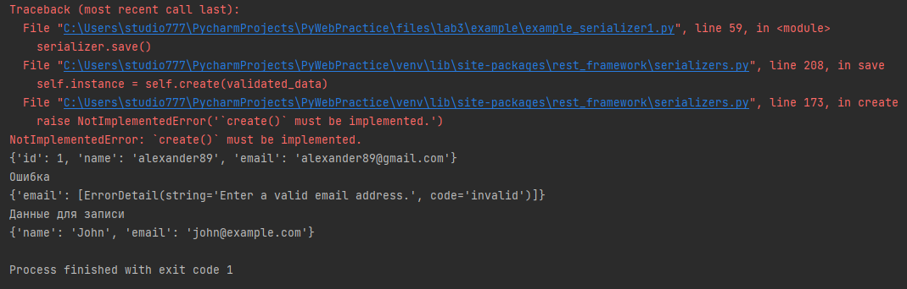

Для того, чтобы работать с моделями недостаточно просто описания полей, необходимо ещё прописать как создаётся объект по этим данным. Смысл сериализации же в том, чтобы из данных Python получить
Json объект, а в десериализации - наборот, из Json получить Python объект. В нашем случае в роли Python объекта понимается
объект модели (таблицы) БД.

Т.е. что происходит. Полями вы описываете какого вида будут данные (строковые, целые и т.д.), эти данные проходят валидацию, 
при помощи метода `is_valid()` и если всё хорошо, то можно их направлять на создание модели и сохранении её в БД.


В `serialisers.py` пропишем методы `create` и `update`:

`create` нужен для создания объекта Python из данных

`update` - для обновления

```python
class AuthorSerializer(serializers.Serializer):
    id = serializers.IntegerField(read_only=True)
    name = serializers.CharField(max_length=200)
    email = serializers.EmailField()

    def create(self, validated_data):
        """
        Создать и вернуть новый объект Author на основе предоставленных проверенных данных.
        """
        return Author.objects.create(**validated_data)

    def update(self, instance, validated_data):
        """
        Обновить и вернуть существующий объект Author на основе предоставленных проверенных данных.
        """
        instance.name = validated_data.get('name', instance.name)
        instance.email = validated_data.get('email', instance.email)
        instance.save()
        return instance
```

Теперь запустите файл `example_serializer2.py` из папки `files/lab3/example`

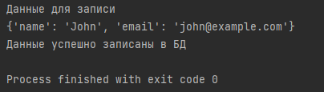

Вот так настроив сериализатор мы смогли создать объект в БД. Преимущество сериализатора в том, что он запишет ровно те поля, 
что прописаны в классе, никах других полей, даже если они и существуют в БД, но не прописаны в классе сериализаторе, то сериализатор 
их не пропустит.

С сериализатором понятно, но что дальше, как его использовать?

### <a name="section-2_2_2"></a> 2.2.2 Создание представления

После создания сериализатора, следующий шаг, это его применение в представлении, но не обычном, что мы привыкли, а представлении из DRF.

В DRF для создания точек доступа к API используются классы представлений (views). Они определяют логику обработки запросов и возвращения ответов API. 
DRF предоставляет множество встроенных классов представлений для обработки различных типов запросов (GET, POST, PUT, DELETE) и типов содержимого (JSON, XML и т. д.). 
Основные шаги создания точки доступа к API в DRF включают:

* Создание класса представления, унаследованного от одного из предоставляемых классов представлений DRF, таких как `APIView`, `GenericAPIView`, `ModelViewSe`t и других.
* Определение методов, соответствующих различным типам запросов (например, `get`, `post`, `put`, `delete`).
* Реализация логики обработки запросов и формирования ответов API в каждом методе представления.


Базовое представление `APIView` которое находится в `rest_framework.views` по своему роду мало чем отличается от привычного нам
`View`. Основное отличие от рассматриваемых ранее концепций, это то, что вместо `JsonResponse` возвращается `Response` из `rest_framework.response`, 
остальное всё похоже, чтобы было ранее, только работу с определением какие данные из БД будем записывать в JSON заменяем на работу с сериализатором.

Во `views.py` приложения `api` пропишите

```python
from rest_framework.views import APIView
from rest_framework.response import Response
from rest_framework import status
from django.views.decorators.csrf import csrf_exempt  # Чтобы post, put, patch, delete не требовали csrf токена (небезопасно)
from apps.db_train_alternative.models import Author
from .serializers import AuthorSerializer


class AuthorAPIView(APIView):
    @csrf_exempt
    def dispatch(self, *args, **kwargs):
        return super().dispatch(*args, **kwargs)

    def get(self, request, pk=None):
        if pk is not None:
            try:
                author = Author.objects.get(pk=pk)
                serializer = AuthorSerializer(author)
                return Response(serializer.data)
            except Author.DoesNotExist:
                return Response({"message": "Автор не найден"}, status=status.HTTP_404_NOT_FOUND)
        else:
            authors = Author.objects.all()
            serializer = AuthorSerializer(authors, many=True)
            return Response(serializer.data)

    def post(self, request):
        serializer = AuthorSerializer(data=request.data)
        if serializer.is_valid():
            serializer.save()
            return Response(serializer.data, status=status.HTTP_201_CREATED)
        return Response(serializer.errors, status=status.HTTP_400_BAD_REQUEST)

    def put(self, request, pk):
        try:
            author = Author.objects.get(pk=pk)
        except Author.DoesNotExist:
            return Response({"message": "Автор не найден"}, status=status.HTTP_404_NOT_FOUND)

        serializer = AuthorSerializer(author, data=request.data)
        if serializer.is_valid():
            serializer.save()
            return Response(serializer.data)
        return Response(serializer.errors, status=status.HTTP_400_BAD_REQUEST)

    def patch(self, request, pk):
        try:
            author = Author.objects.get(pk=pk)
        except Author.DoesNotExist:
            return Response({"message": "Автор не найден"}, status=status.HTTP_404_NOT_FOUND)

        serializer = AuthorSerializer(author, data=request.data, partial=True)
        if serializer.is_valid():
            serializer.save()
            return Response(serializer.data)
        return Response(serializer.errors, status=status.HTTP_400_BAD_REQUEST)

    def delete(self, request, pk):
        try:
            author = Author.objects.get(pk=pk)
        except Author.DoesNotExist:
            return Response({"message": "Автор не найден"}, status=status.HTTP_404_NOT_FOUND)

        author.delete()
        return Response(status=status.HTTP_204_NO_CONTENT)
```

Судя из кода может возникнуть вопрос. Зачем использовать `status=status.HTTP_404_NOT_FOUND`, если можно использовать `status=404` и другие коды статусов?

Можно использовать как `status=404`, так и `status=status.HTTP_404_NOT_FOUND`. Оба варианта эквивалентны.

Модуль `status` в Django REST Framework предоставляет набор стандартных статусных кодов HTTP для удобства использования 
в представлениях и сериализаторах. Использование `status=status.HTTP_404_NOT_FOUND` является более явным и может быть предпочтительным для поддержания читаемости кода 
и уменьшения вероятности ошибок в случае изменения значений статусов в будущем. 
Однако это не обязательно, и вы можете использовать любой из вариантов в зависимости от предпочтений.

Сравните подходы в написании `View` через `JsonResponse` (на примере AuthorREST из `views.py` в `db_train_alternative`) 
и `APIView` с `Response` (на примере AuthorAPIView из `views.py` в `api`)


После создания представления, то необходимо указать по какому маршруту оно будет вызываться.

### <a name="section-2_2_3"></a> 2.2.3 Настройка маршрутизации (URL Routing)

Для связывания точек доступа к API с конкретными URL-адресами используется механизм маршрутизации. В DRF обычно используется модуль `urlpatterns` в файле `urls.py`, 
где определяются URL-шаблоны и их связь с классами представлений. 
Каждой точке доступа к API присваивается свой уникальный URL-шаблон.
URL-шаблон может содержать дополнительные параметры, такие как идентификаторы ресурсов.

В `urls.py` приложения `api` пропишем 

```python
from django.urls import path
from .views import AuthorAPIView

urlpatterns = [
    path('authors/', AuthorAPIView.as_view(), name='author-list'),
    path('authors/<int:pk>/', AuthorAPIView.as_view(), name='author-detail'),
]
```
Последнее, что осталось сделать, это зарегистрировать сам роутер для приложения `api`.

Для этого в `urls.py` папки `project` пропишем

```python
urlpatterns = [
    # ...
    path('api/', include('apps.api.urls')),
]
```

## <a name="section-2_3"></a> 2.3 Проверка маршрутов

Если перейти на ссылку

http://127.0.0.1:8000/api/authors/

То вид формы изменится, это произошло, так как ранее мы прописали `path('api-auth/', include('rest_framework.urls', namespace='rest_framework'))`, 
это аналог админ панели, но для DRF.

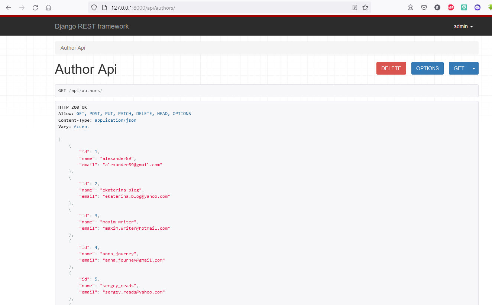

При этом прошлые точки на JsonResponse отображаются как и ранее

http://127.0.0.1:8000/api_alter/author/

В DRF панели возможно выполнять аналогичные действия, что и в Postman.

Допустим необходимо создать нового автора, через эту панель, тогда используем POST запрос с данными

```text
{
    "name": "user10",
    "email": "user10@user.com"
}
```


Новый автор создан

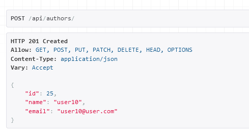

Всё аналогично Postman, только с урезанным функционалом.

## <a name="section-2_4"></a> 2.4 Сериализатор модели

Если вы работаете с моделью, то для этого в сериализаторе можно отнаследоваться не от `serializers.Serializer`, а от 
`serializers.ModelSerializer`

`ModelSerializer` и `Serializer` - это два основных класса сериализаторов в Django REST Framework (DRF), и они оба используются 
для преобразования данных между объектами Python и форматом JSON (или другими форматами данных).

Вот основные различия между ними:

*ModelSerializer*:

* ModelSerializer является подклассом Serializer, специально оптимизированным для работы с моделями Django.
* Он автоматически создает поля сериализатора на основе полей модели.
* Предоставляет встроенную поддержку для создания и обновления объектов модели.
* Обычно используется для простой сериализации и десериализации моделей Django в JSON и обратно.

*Serializer*:

* Serializer - это более общий класс, который позволяет более гибко определять поля сериализатора вручную.
* Он не связан прямо с моделями Django и не предоставляет встроенной поддержки для создания и обновления объектов модели.
* Это полезно в случаях, когда вам нужно сделать что-то более сложное, чем просто отображение полей модели, или когда вам нужна сериализация данных, которые не связаны с моделями Django.

Основное преимущество `ModelSerializer` в том, что поля генерируются автоматически на основании модели, но всегда необходимо указать какие поля будем использовать

В `serializers.py` создадим новый класс `AuthorModelSerializer`, аналогичный `AuthorSerializer`, но уже наследующийся от `serializers.ModelSerializer`

```python
class AuthorModelSerializer(serializers.ModelSerializer):
    class Meta:
        model = Author
        fields = ['id', 'name', 'email']  # или можно прописать '__all__' если нужны все поля
```

Код приведенный выше аналогичен коду написанному в `AuthorSerializer`

Все настройки в классе от `serializers.ModelSerializer` проходят в мета классе `class Meta`

`ModelSerializer` в `DRF` предоставляет несколько настроек для определения поведения сериализатора при работе с моделями 
Django. Вот некоторые из основных настроек и их назначение:

* `model`: Определяет модель, с которой работает сериализатор. Это обязательная настройка.

* `fields`: Список имен полей модели, которые должны быть включены в сериализатор. Если не указано, будут использованы все поля модели.

* `exclude`: Список имен полей модели, которые должны быть исключены из сериализатора.

* `read_only_fields`: Список имен полей модели, которые должны быть доступны только для чтения.

* `write_only_fields`: Список имен полей модели, которые должны быть доступны только для записи.

* `validators`: Дополнительные валидаторы, которые будут применяться к данным модели.

* `error_messages`: Пользовательские сообщения об ошибках для полей модели.

* `extra_kwargs`: Дополнительные параметры для каждого поля, такие как `required`, `allow_null`, `read_only`, `write_only` и т. д.

Ради интереса во `views.py` приложения `api` в `AuthorAPIView` замените `AuthorSerializer` на `AuthorModelSerializer` (не забудьте импортировать AuthorModelSerializer)

Функционал не поменяется, а сериализатор при создании стал короче.

# Практика окончена

---

# <a name="section-optional-block"></a> <u>Необязательный блок</u> (выполнение по желанию, на результат следующих практик влиять не будет)

