# Оглавление

* 1.Использование GenericApiView
  * 1.1. Что ещё mixin и зачем они нужны?
  * 1.2. Что ещё есть в rest_framework.generics?
  * 1.3 Создание представления на GenericApiView
* 2.Использование ViewSet
  * 2.1 Создание представления
    * 2.1.1 ViewSet
    * 2.1.2 GenericViewSet
    * 2.1.3 ReadOnlyModelViewSet
    * 2.1.4 ModelViewSet
  * 2.2 Маршрутизация
  * 2.3 Поддерживание дополнительных действий
  * 2.4 Ограничение поддерживаемых методов для всего представления
* 3.Пагинация
* 4.Фильтрация
  * 4.1 Переопределение get_queryset
  * 4.2 Использование DjangoFilterBackend
* 5.Тестирование
  * 5.1 Тестирование AuthorViewSet
  * 5.2 Самостоятельно (по желанию)
* Необязательный блок

---

# 1. Использование GenericApiView

`GenericAPIView` - это представление в Django REST Framework, которое предоставляет множество удобных методов и функциональности для работы с API 
на основе обобщенных (`generic`) представлений. 
Они представляют собой высокоуровневый способ создания API, который обрабатывает множество типичных сценариев, 
таких как создание, чтение, обновление и удаление объектов.

`GenericAPIView` - это просто более высокоуровневое представление `APIView` 

Преимущества использования `GenericAPIView`:

* `Упрощенный код`: `GenericAPIView` позволяет сократить количество кода благодаря использованию предварительно 
реализованных методов для типичных операций `CRUD` (`Create`, `Retrieve`, `Update`, `Delete`).


* `Гибкость и настраиваемость`: Они предоставляют гибкую и настраиваемую структуру для создания API, 
позволяя вам добавлять пользовательский функционал при необходимости.


* `Уменьшение вероятности ошибок`: Использование стандартных методов и функциональности в `GenericAPIView` помогает 
снизить вероятность ошибок и упростить отладку.

`GenericAPIView` находится в `rest_framework.generics`

Прежде чем окунуться в то, какие есть generic представления и как ими пользоваться необходимо уточнить, что `GenericAPIView`
это базовый класс, который имеет определенную функциональность, но лишен управлять поведением запросов из коробки, т.е. 
как в случае с `APIView` необходимо прописывать `get`, `post`, `put`, `patch`, `delete` запросы вручную. Однако нам на помощь приходят
специальные классы, их называют миксины, которые за счет наследования помогают добавить основные действия `CRUD` по управлению.

## 1.1. Что ещё mixin и зачем они нужны?

`Mixin` - это специальный тип класса в объектно-ориентированном программировании, который используется для добавления 
функциональности в классы, не создавая циклических зависимостей или дублирования кода. Они представляют собой небольшие, 
легко переиспользуемые блоки функциональности, которые могут быть добавлены к классам через множественное наследование.

Миксины (mixins) расположены в `rest_framework.mixins`

В Django REST Framework (rest_framework.mixins) mixin-классы предоставляют небольшие кусочки поведения, которые можно добавлять 
к представлениям API. Они позволяют вам быстро расширять функциональность ваших представлений, добавляя дополнительные методы и функции.

`mixin-классы` в Django REST Framework и их назначение:

* `CreateModelMixin` - Добавляет метод `create()` для создания нового объекта модели.

    > (код DRF из `rest_framework.mixins`)

    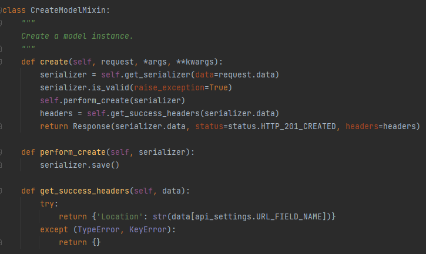

* `ListModelMixin` - Добавляет метод `list()` для получения списка объектов модели

    > (код DRF из `rest_framework.mixins`)

    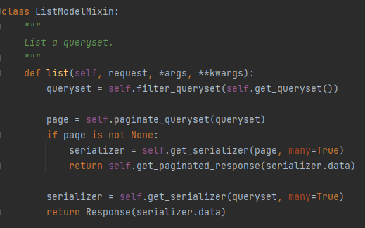

* `RetrieveModelMixin` - Добавляет метод `retrieve()` для получения конкретного объекта модели по его идентификатору

    > (код DRF из `rest_framework.mixins`)

    

* `UpdateModelMixin` - Добавляет метод `update()` для обновления существующего объекта модели

    > (код DRF из `rest_framework.mixins`)

    

* `DestroyModelMixin` - Добавляет метод `destroy()` для удаления существующего объекта модели

    > (код DRF из `rest_framework.mixins`)

    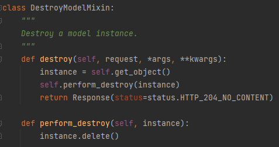

Допустим вот пример кода (для ознакомления):

```python
class AuthorGenericAPIView(GenericAPIView, ListModelMixin, CreateModelMixin):
    queryset = Author.objects.all()
    serializer_class = AuthorSerializer
```
Здесь мы добавляем возможность поддерживать отображения списочной информации `ListModelMixin` (GET) запрос 
и добавления информации `CreateModelMixin` (POST) запрос

Но если попытаться выполнить запрос, чтобы это представление отрабатывало, то вернется ошибка с текстом, что данный метод запроса не доступен

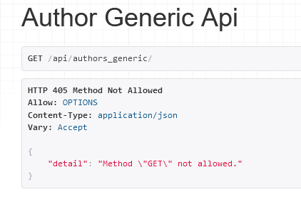


Как в `APIView`, так и в `GenericAPIView` необходимо явно прописывать методы, которые хотите, чтобы поддерживались, однако в `GenericAPIView` 
тогда необходимо явно прописать какие именно методы из mixins вызываются в методах `get`, `post`, `put`, `patch`, `delete`

(для ознакомления)
```python
class AuthorGenericAPIView(GenericAPIView, ListModelMixin, CreateModelMixin):
    queryset = Author.objects.all()
    serializer_class = AuthorSerializer

    def get(self, request, *args, **kwargs):
        return self.list(request, *args, **kwargs)

    def post(self, request, *args, **kwargs):
        return self.create(request, *args, **kwargs)
```


## 1.2. Что ещё есть в rest_framework.generics?
Теперь когда разобрались с тем что такое миксины и как они применяются, то самое время разобраться какие 
есть ещё общие представления в `rest_framework.generics`

В `rest_framework.generics` есть несколько классов, которые обеспечивают базовую функциональность для создания обобщенных 
представлений в Django REST Framework. Вот основные классы и их назначение:

* `GenericAPIView`: Представляет базовое обобщенное представление API.
Он предоставляет ряд методов и атрибутов, которые позволяют обрабатывать различные типы запросов HTTP и взаимодействовать с сериализаторами и моделями.
Обычно используется в сочетании с одним или несколькими "mixin" классами для добавления функциональности.
Например, ListModelMixin для поддержки операции списка (GET), CreateModelMixin для операции создания (POST) и т. д.

`(код GenericAPIView из DRF не предоставлен, так как большой)`

* `ListAPIView`: Предоставляет обобщенное представление для получения списка объектов.
Он наследует GenericAPIView и использует ListModelMixin для добавления поддержки операции списка (GET).

    > (код DRF из `rest_framework.generics`)

    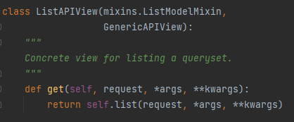


* `RetrieveAPIView`: Предоставляет обобщенное представление для получения конкретного объекта по его идентификатору.
Он наследует GenericAPIView и использует RetrieveModelMixin для добавления поддержки операции получения (GET) конкретного объекта.

    > (код DRF из `rest_framework.generics`)

    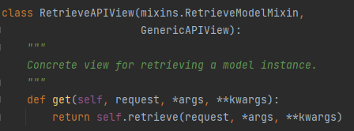

* `CreateAPIView`: Предоставляет обобщенное представление для создания нового объекта.
Он наследует GenericAPIView и использует CreateModelMixin для добавления поддержки операции создания (POST) нового объекта.

    > (код DRF из `rest_framework.generics`)

    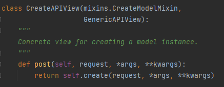

* `UpdateAPIView`: Предоставляет обобщенное представление для обновления существующего объекта.
Он наследует GenericAPIView и использует UpdateModelMixin для добавления поддержки операции обновления (PUT) существующего объекта.

    > (код DRF из `rest_framework.generics`)

    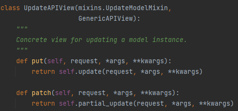

* `DestroyAPIView`: Предоставляет обобщенное представление для удаления существующего объекта.
Он наследует GenericAPIView и использует DestroyModelMixin для добавления поддержки операции удаления (DELETE) существующего объекта.

    > (код DRF из `rest_framework.generics`)

    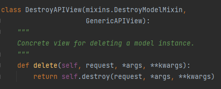

В добавок существуют уже созданные классы, комбинирующие в себе несколько типовых миксинов:

* `ListCreateAPIView`: Предоставляет обобщенное представление для получения списка объектов и создания нового объекта.
Он наследует `GenericAPIView` и использует `ListModelMixin` и `CreateModelMixin` для добавления поддержки операций списка (GET) и создания (POST) нового объекта.

    > (код DRF из `rest_framework.generics`)

    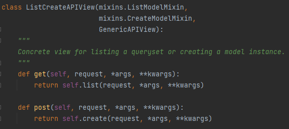


* `RetrieveUpdateAPIView`: Предоставляет обобщенное представление для получения и обновления конкретного объекта. 
Он наследует GenericAPIView и использует RetrieveModelMixin и UpdateModelMixin для добавления поддержки операций получения (GET) и обновления (PUT) существующего объекта.

    > (код DRF из `rest_framework.generics`)

    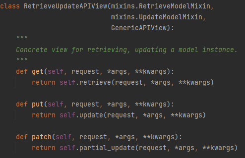

* `RetrieveDestroyAPIView`: Предоставляет обобщенное представление для получения и удаления конкретного объекта.
Он наследует `GenericAPIView` и использует `RetrieveModelMixin` и `DestroyModelMixin` для добавления поддержки операций получения (GET) и удаления (DELETE) существующего объекта.

    > (код DRF из `rest_framework.generics`)

    

* `RetrieveUpdateDestroyAPIView`: Предоставляет обобщенное представление для получения, изменения и удаления конкретного объекта.
Он наследует `GenericAPIView` и использует `RetrieveModelMixin`, `UpdateModelMixin` и `DestroyModelMixin` для добавления поддержки операций получения (GET), обновления (PUT, PATCH) и удаления (DELETE) 
существующего объекта.

    > (код DRF из `rest_framework.generics`)

    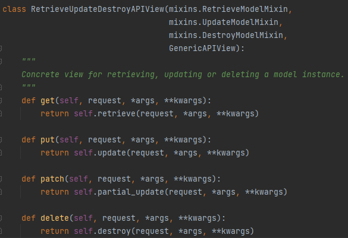


Эти классы позволяют создавать обобщенные представления API с различными комбинациями операций CRUD (Create, Retrieve, Update, Delete), что делает разработку API более быстрой и удобной.

## 1.3 Создание представления на GenericApiView

Теперь уже с полным понимаем мы готовы создать и использовать представления на `GenericApiView`

Во `views.py` приложения `api` создайте `AuthorGenericAPIView`

```python
from django.http import Http404
from rest_framework.generics import GenericAPIView
from rest_framework.mixins import RetrieveModelMixin, ListModelMixin, CreateModelMixin, UpdateModelMixin, DestroyModelMixin
from .serializers import AuthorModelSerializer


class AuthorGenericAPIView(GenericAPIView, RetrieveModelMixin, ListModelMixin, CreateModelMixin, UpdateModelMixin,
                           DestroyModelMixin):
    queryset = Author.objects.all()
    serializer_class = AuthorModelSerializer

    def get(self, request, *args, **kwargs):
        if kwargs.get(self.lookup_field):  # если был передан id или pk
            # возвращаем один объект
            return self.retrieve(request, *args, **kwargs)
        # Иначе возвращаем список объектов
        return self.list(request, *args, **kwargs)

    def post(self, request, *args, **kwargs):
        return self.create(request, *args, **kwargs)

    def put(self, request, *args, **kwargs):
        return self.update(request, *args, **kwargs)

    def patch(self, request, *args, **kwargs):
        return self.partial_update(request, *args, **kwargs)

    def delete(self, request, *args, **kwargs):
        return self.destroy(request, *args, **kwargs)
```

Так образом мы записали аналогичные действия как в `AuthorAPIView`, но с `GenericAPIView` и миксинами.

В методе `get` было использовано `if kwargs.get(self.lookup_field)` чтобы проверить, что был передан соответствующий ключ
pk, чтобы понять хотим мы всё получить или только какого-то конкретного автора.

Осталось только создать новый маршрут, чтобы использовать данное представление

в `urls.py` приложения `api` допишите маршруты

```python
from .views import AuthorGenericAPIView

urlpatterns = [
    # ...
    path('authors_generic/', AuthorGenericAPIView.as_view(), name='author-generic-list'),
    path('authors_generic/<int:pk>/', AuthorGenericAPIView.as_view(), name='author-generic-detail'),
]
```

Проверьте работоспособность маршрутов 

http://127.0.0.1:8000/api/authors_generic/

http://127.0.0.1:8000/api/authors_generic/1/

http://127.0.0.1:8000/api/authors_generic/30/

На последнем запросе возникает ошибка, так как автора не существует, о чем свидетельствует сообщение

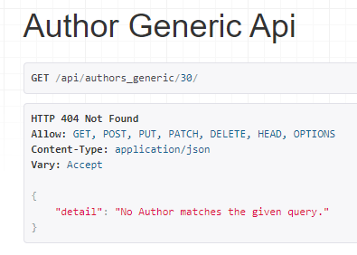

Допустим нам не нравится сообщение или по какому ключу оно отправлено, тогда его можно изменить отловив эту ошибку и отправив свой текст

```python
from django.http import Http404


class AuthorGenericAPIView(GenericAPIView, RetrieveModelMixin, ListModelMixin, CreateModelMixin, UpdateModelMixin,
                           DestroyModelMixin):
    # ...

    def get(self, request, *args, **kwargs):
        if kwargs.get(self.lookup_field):
            try:
                # возвращаем один объект
                return self.retrieve(request, *args, **kwargs)
            except Http404:
                return Response({'message': 'Автор не найден'}, status=status.HTTP_404_NOT_FOUND)
        else:
            # Иначе возвращаем список объектов
            return self.list(request, *args, **kwargs)
    
    # ...
```

Теперь если нет автора, то сообщение то, что и хотели

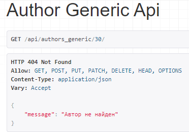

Далее проверим работоспособность POST метода через DRF панель.

Если пролистать вниз, то можно обнаружить, что теперь появилась форма для отправки запросов, а не просто сырой json

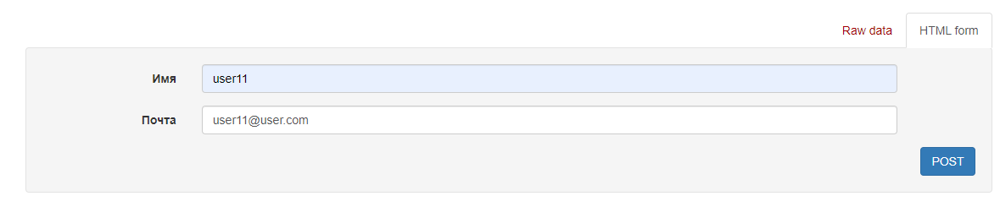

При отправке создастся новый автор

Остальные методы `PUT`, `PATCH`, `DELETE` проверьте самостоятельно через DRF панель

# 2. Использование ViewSet

Поднимаемся на уровень абстрации повыше и там нас встречает `ViewSet`

`ViewSet` в Django REST Framework - это удобный способ организации логики представлений API для работы с моделями. 
Он представляет собой класс, который объединяет несколько типов представлений 
(например, просмотр списка объектов, создание нового объекта, получение конкретного объекта, обновление объекта и удаление объекта) в один. 
Это позволяет упростить код и уменьшить его дублирование.

`ViewSet` может работать как с обычными представлениями, так и с обобщенными представлениями 
(например, `ListModelMixin`, `CreateModelMixin`, `RetrieveModelMixin`, `UpdateModelMixin`, `DestroyModelMixin`). 
Он предоставляет стандартные методы для каждой операции CRUD (`Create`, `Retrieve`, `Update`, `Delete`), которые могут 
быть переопределены по мере необходимости.

Для использования `ViewSet` в Django REST Framework нужно сначала создать класс, наследующийся от одного из базовых классов 
`ViewSet` (`ViewSet`, `GenericViewSet`, `ReadOnlyModelViewSet`, `ModelViewSet`) 
и определить логику для каждой операции, если это необходимо. Затем этот класс регистрируется с помощью маршрутизатора 
(например, `DefaultRouter` или `SimpleRouter`), чтобы он мог быть доступен по определенным URL.

## 2.1 Создание представления

### 2.1.1 ViewSet

Класс `ViewSet` это расширение `APIView` вместе со специальным миксин классом `ViewSetMixin`, который позволяет задавать 
дополнительные действия

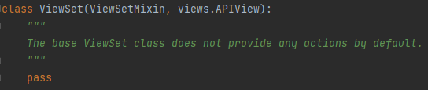

Ниже приведен код просто для ознакомления, чтобы посмотреть как бы выглядел код представления с использованием `ViewSet`

```python
from rest_framework import viewsets
from rest_framework.response import Response
from .models import Author
from .serializers import AuthorSerializer
from rest_framework import status
from django.shortcuts import get_object_or_404


class AuthorViewSet(viewsets.ViewSet):
    def list(self, request):
        queryset = Author.objects.all()
        serializer = AuthorSerializer(queryset, many=True)
        return Response(serializer.data)

    def retrieve(self, request, pk=None):
        queryset = Author.objects.all()
        author = get_object_or_404(queryset, pk=pk)
        serializer = AuthorSerializer(author)
        return Response(serializer.data)

    def create(self, request):
        serializer = AuthorSerializer(data=request.data)
        if serializer.is_valid():
            serializer.save()
            return Response(serializer.data, status=status.HTTP_201_CREATED)
        return Response(serializer.errors, status=status.HTTP_400_BAD_REQUEST)

    def update(self, request, pk=None):
        author = Author.objects.get(pk=pk)
        serializer = AuthorSerializer(author, data=request.data)
        if serializer.is_valid():
            serializer.save()
            return Response(serializer.data)
        return Response(serializer.errors, status=status.HTTP_400_BAD_REQUEST)

    def partial_update(self, request, pk=None):
        author = Author.objects.get(pk=pk)
        serializer = AuthorSerializer(author, data=request.data, partial=True)
        if serializer.is_valid():
            serializer.save()
            return Response(serializer.data)
        return Response(serializer.errors, status=status.HTTP_400_BAD_REQUEST)

    def destroy(self, request, pk=None):
        author = Author.objects.get(pk=pk)
        author.delete()
        return Response(status=status.HTTP_204_NO_CONTENT)
```
Как видите, в отличие от `APIView`, где мы прописывали методы `get`, `post`, `put`, `patch`, `delete`, то в `ViewSet`
прописываем `list`, `retrieve`, `create`, `update`, `partial_update`, `destroy`. Всё встанет на свои места, 
когда мы будем проводить маршрутизацию.

Кода много, но полезно когда хотите держать всё под контролем. Этот подход требует больше кода по сравнению с использованием `ModelViewSet` или `GenericViewSet`, 
но дает больше контроля над каждым методом представления.

### 2.1.2 GenericViewSet

Класс `GenericViewSet` это расширение `GenericAPIView` вместе со специальным миксин классом `ViewSetMixin`, который позволяет задавать 
дополнительные действия

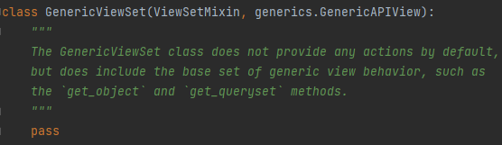

Приведенный код снова просто для ознакомления, чтобы посмотреть как бы выглядел код представления с использованием `GenericViewSet`. 
Ранее мы выяснили, что в Generic нужно передавать mixins, иначе всё нужно будет писать руками, поэтому код особо не будет отличаться от
кода выше, единственное, что в GenericViewSet доступен классовый атрибут `queryset` и `serializer_class`, которого нет в обычном
`ViewSet`

```python
from rest_framework import viewsets
from rest_framework.response import Response
from .models import Author
from .serializers import AuthorSerializer
from rest_framework import status

class AuthorViewSet(viewsets.GenericViewSet):
    queryset = Author.objects.all()
    serializer_class = AuthorSerializer

    def list(self, request):
        queryset = self.get_queryset()
        serializer = self.get_serializer(queryset, many=True)
        return Response(serializer.data)

    def retrieve(self, request, pk=None):
        author = self.get_object()
        serializer = self.get_serializer(author)
        return Response(serializer.data)

    def create(self, request):
        serializer = self.get_serializer(data=request.data)
        if serializer.is_valid():
            serializer.save()
            return Response(serializer.data, status=status.HTTP_201_CREATED)
        return Response(serializer.errors, status=status.HTTP_400_BAD_REQUEST)

    def update(self, request, pk=None):
        author = self.get_object()
        serializer = self.get_serializer(author, data=request.data)
        if serializer.is_valid():
            serializer.save()
            return Response(serializer.data)
        return Response(serializer.errors, status=status.HTTP_400_BAD_REQUEST)

    def partial_update(self, request, pk=None):
        author = self.get_object()
        serializer = self.get_serializer(author, data=request.data, partial=True)
        if serializer.is_valid():
            serializer.save()
            return Response(serializer.data)
        return Response(serializer.errors, status=status.HTTP_400_BAD_REQUEST)

    def destroy(self, request, pk=None):
        author = self.get_object()
        author.delete()
        return Response(status=status.HTTP_204_NO_CONTENT)
```

### 2.1.3 ReadOnlyModelViewSet

Расширение `GenericViewSet`, с добавлением методов `list()` и `retrieve()`

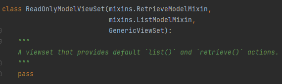

Класс не зря назван `ReadOnlyModelViewSet` так как в нём содержатся только методы для обработки GET запроса, без возможности
изменения объектов в БД

### 2.1.4 ModelViewSet

Самый часто употребимый класс из блока ViewSet. Является расширением `GenericViewSet`, но зато каким! Класс расширен всеми доступными миксинами,
т.е. сразу обладает методами `list`, `retrieve`, `create`, `update`, `partial_update`, `destroy`, которые ***если это не требуется (для вашей логики API или взаимодействия с БД),
то не нужно переопределять***.

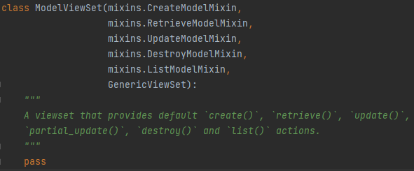

Так что код теперь будет таким, его и добавим во `views.py` приложения `api`

```python
from rest_framework.viewsets import ModelViewSet

class AuthorViewSet(ModelViewSet):
    queryset = Author.objects.all()
    serializer_class = AuthorModelSerializer
```

Коротко и лаконично.


## 2.2 Маршрутизация

Осталось только зарегистрировать маршруты у нашего `AuthorViewSet`

Регистрация маршрутов в представлений типа `ViewSet` (`ViewSet`, `GenericViewSet`, `ReadOnlyModelViewSet`, `ModelViewSet`) 
отличается от ранее используемых. Для этого используется специальный класс `DefaultRouter` или `SimpleRouter` в который передаётся ViewSet и название маршрута, затем
уже данный роутер регистрируется более привычным способом.

В `urls.py` приложения `api` пропишем

```python
from django.urls import include
from .views import AuthorViewSet
from rest_framework.routers import DefaultRouter

router = DefaultRouter()
router.register(r'authors_viewset', AuthorViewSet, basename='authors-viewset')

urlpatterns = [
    # ...
    path('', include(router.urls)),
]
```

В этом коде:

* Создается экземпляр класса `DefaultRouter`.
* Представление `AuthorViewSet` регистрируется в роутере под именем `'authors_viewset'`.

В роутере маршруты автоматически создадутся для каждого метода представления `AuthorViewSet` (GET, POST, PUT, PATCH, DELETE) 
и будут доступны по URL `/authors_viewset/` для списка авторов и `/authors_viewset/<pk>/` для конкретного автора, 
где <pk> - это первичный ключ автора.

В Django REST Framework, когда вы используете `router.register()` для регистрации представления в роутере, 
параметр `basename` определяет базовое имя для создаваемых URL. Это базовое имя используется при генерации именованных URL в представлениях, связанных с роутером.
В общем случае это что-то похоже, что ранее передавалось в параметр `name` в `path`

Вот как это работает:

Каждое представление, зарегистрированное в роутере, получает три именованных URL: 
* `<basename>-list`, 
* `<basename>-detail`, 
* `<basename>-set`. 

Например, если вы укажете `basename='authors-viewset'`, то URL для списка объектов будет иметь имя `authors-viewset-list`, 
для конкретного объекта - `author-detail`, 
а для набора - `authors-viewset-set`.
Эти имена можно использовать в методах reverse() или reverse_lazy() для генерации URL внутри вашего кода.

Общий код во `views.py` выглядит так

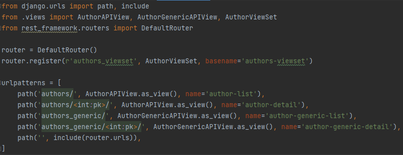

Теперь если пройти по маршруту http://127.0.0.1:8000/api/a чтобы посмотреть какие были созданы, то увидим, что router создал несколько
маршрутов

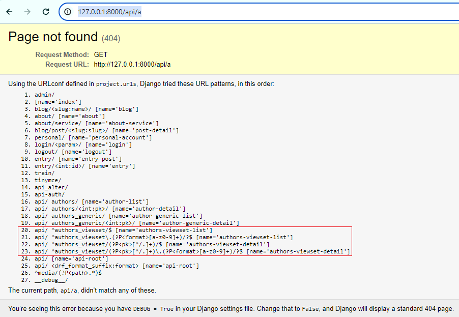

Всё остальное полностью работоспособно по маршрутам

http://127.0.0.1:8000/api/authors_viewset/

http://127.0.0.1:8000/api/authors_viewset/10/


## 2.3 Поддерживание дополнительных действий

`ModelViewSet` поддерживает написание пользовательский действий, т.е. методов (которые не вписываются в стандартные операции CRUD), которые будут вызываться при заходе на определенный путь.

Вы можете указать, на каких типах запросов может запускаться пользовательское действие, используя атрибут `action` в методе `@action декоратора`. 
Этот декоратор предоставляется Django REST Framework для добавления пользовательских действий к вашим представлениям ViewSet.
По названию вашего метода будет сформирован маршрут с этим названием.

Во `views.py` приложения `api` в `AuthorViewSet` пропишем

```python
from rest_framework.decorators import action
from rest_framework.response import Response

class AuthorViewSet(ModelViewSet):
    queryset = Author.objects.all()
    serializer_class = AuthorModelSerializer

    @action(detail=True, methods=['post'])
    def my_action(self, request, pk=None):
        # Ваша пользовательская логика здесь
        return Response({'message': f'Пользовательская функция для пользователя с pk={pk}'})
```

`@action(detail=True, methods=['post'])` указывает, что пользовательское действие custom_action доступно только для объектов, 
а не для всего списка (`detail=True`), и может быть запущено только с HTTP методом POST (`methods=['post']`).

`pk=None` означает, что этот метод принимает параметр идентификатора (pk), который используется для получения объекта из базы данных.

Таким образом, пользовательское действие `my_action` теперь доступно только для HTTP POST запросов и может быть вызвано только для конкретных объектов.

Теперь появились новые маршруты

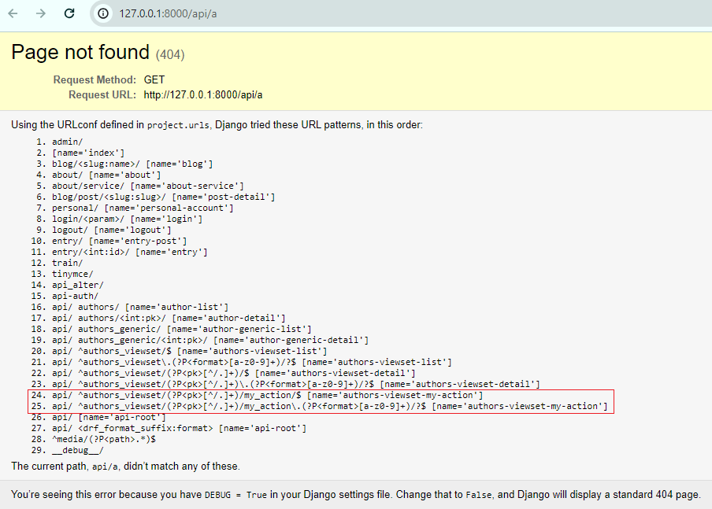

GET Запрос не работает http://127.0.0.1:8000/api/authors_viewset/10/my_action/

А вот POST работает

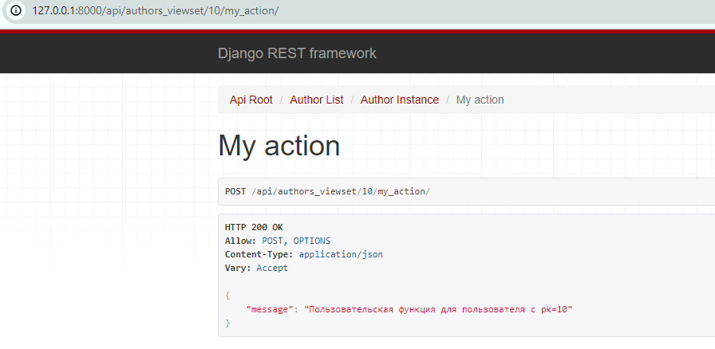

## 2.4 Ограничение поддерживаемых методов для всего представления

По умолчанию `ModelViewSet` поддерживает все методы `GET`, `POST`, `PUT`, `PATCH`, `DELETE`, но это можно ограничить.

Делается это на этапе создания представления в классовом атрибуте `http_method_names`, как пример 

```python
class AuthorViewSet(viewsets.ModelViewSet):
    queryset = Author.objects.all()
    serializer_class = AuthorSerializer
    http_method_names = ['get', 'post']
```

В таком случае представление `AuthorViewSet` будет поддерживать только методы `GET` и `POST`

# 3. Пагинация

Пагинация - это процесс разделения большого списка данных на отдельные страницы для улучшения производительности и удобства использования. 
Веб-приложения часто используют пагинацию для отображения больших объемов данных, таких как результаты поиска или список записей.

`DRF` предоставляет множество встроенных классов пагинации для различных видов пагинации, 
таких как стандартная пагинация, курсорная пагинация, пагинация на основе номеров страниц и т. д.

Чтобы применить пагинацию в `AuthorViewSet`, вы можете использовать классы пагинации `DRF` и настроить их в соответствии 
с вашими потребностями. 

Например, вы можете добавить следующий код в ваш `AuthorViewSet`, чтобы применить стандартную пагинацию:

```python
from rest_framework.pagination import PageNumberPagination


class AuthorPagination(PageNumberPagination):
    page_size = 5  # количество объектов на странице
    page_size_query_param = 'page_size'  # параметр запроса для настройки количества объектов на странице
    max_page_size = 1000  # максимальное количество объектов на странице


class AuthorViewSet(ModelViewSet):
    queryset = Author.objects.all()
    serializer_class = AuthorModelSerializer
    pagination_class = AuthorPagination

    # Остальные методы
```

Пагинация применяется для результатов запроса метода `list()`, т.е. в нашем случае для `GET` запроса

Отобразим всех авторов http://127.0.0.1:8000/api/authors_viewset/ теперь их будет всего 5 и будет ещё дополнительная информация.

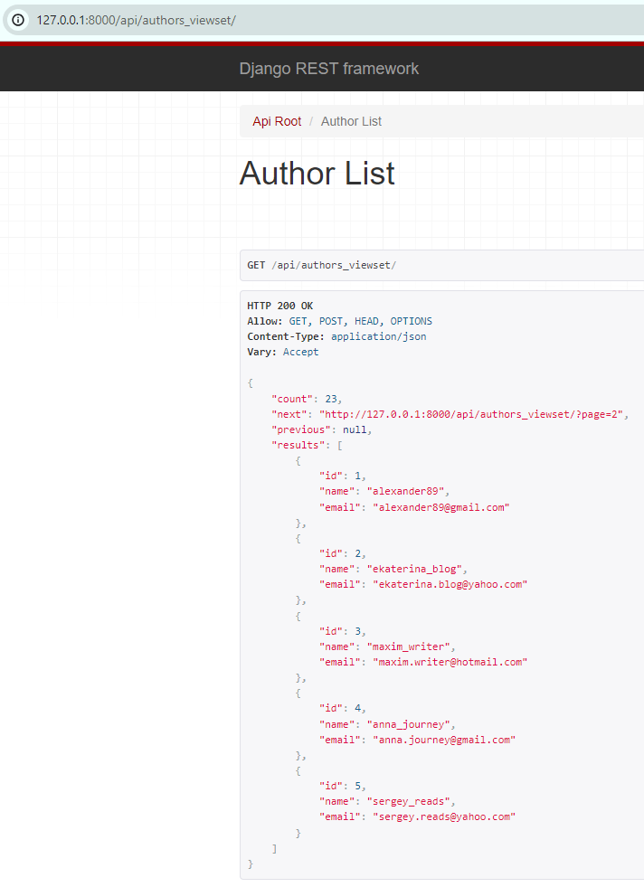

Передадим в запрос параметр `page` со значением страницы, которую хотим отобразить http://127.0.0.1:8000/api/authors_viewset/?page=2

Пагинация работает, если ходим изменить число выводимых авторов, то это можно сделать прямо через параметр `page_size`

http://127.0.0.1:8000/api/authors_viewset/?page=1&page_size=10 теперь отображается 10 авторов на странице.

# 4. Фильтрация

Для интересующихся можно почитать перевод [документации](https://django.fun/docs/django-rest-framework/3.12/api-guide/filtering/)

По умолчанию общие представления списков в REST framework возвращают весь набор запросов для менеджера модели. 
Часто вы хотите, чтобы ваш API ограничивал элементы, возвращаемые набором запросов.


## 4.1 Переопределение get_queryset

Самый простой способ фильтровать набор запросов любого представления, которое является подклассом `GenericAPIView` 
(`GenericAPIView`, `GenericViewSet`, `ReadOnlyModelViewSet`, `ModelViewSet`) - это переопределить метод `get_queryset()`.

Вы можете определить параметры запроса URL, которые будут использоваться для фильтрации данных. 
Например, если у вас есть модель `Author`, и вы хотите фильтровать авторов по содержанию определенного слова в их имени(а не так как они выводятся по умолчанию), 
вы можете сделать это следующим образом.

```python
class AuthorViewSet(ModelViewSet):
    queryset = Author.objects.all()
    serializer_class = AuthorModelSerializer
    pagination_class = AuthorPagination

    def get_queryset(self):
        queryset = super().get_queryset()
        name = self.request.query_params.get('name')
        if name:
            queryset = queryset.filter(name__contains=name)
        return queryset

    # Остальные методы
```

Рассмотрите следующие запросы:

Сначала без фильтрации

http://127.0.0.1:8000/api/authors_viewset/

Затем с фильтрацией

http://127.0.0.1:8000/api/authors_viewset/?name=blog

## 4.2 Использование DjangoFilterBackend

DRF также поддерживает стороннюю библиотеку `django-filter`, которая предоставляет более гибкий и мощный способ фильтрации данных. 
Для использования [django-filter](https://django-filter.readthedocs.io/en/stable/guide/rest_framework.html) с `DRF`, вам необходимо настроить фильтры в соответствующем классе фильтра.

Установим её

```python
pip install django-filter
```

Затем добавьте `'django_filters'` к `INSTALLED_APPS` в корневой `settings.py`:

Расширим `AuthorViewSet` во `views.py` приложения `api` 

```python
from django_filters.rest_framework import DjangoFilterBackend

class AuthorViewSet(ModelViewSet):
    # ...
    filter_backends = [DjangoFilterBackend]
    filterset_fields = ['name', 'email']  # Указываем для каких полем можем проводить фильтрацию
```

Если зайти в панель DRF, напримена на http://127.0.0.1:8000/api/authors_viewset/, то появится кнопка `Filters`

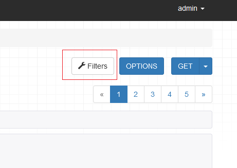

Где высветится поле

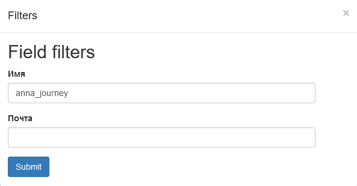

Впишите туда `anna_journey` и нажмите submit

Произойдет фильтрование, а в адресной строке вы увидите путь http://127.0.0.1:8000/api/authors_viewset/?name=anna_journey&email=

Аналогично можно проводить фильтрование по полям в адресной строке.

В DRF есть свои встроенные фильтрации в модуле `from rest_framework import filters` такие как:

* `SearchFilter` - Этот фильтр позволяет выполнить поиск по определенным полям модели. Он работает путем фильтрации queryset на основе заданного поискового запроса, переданного в параметре запроса URL

* `OrderingFilter` - Этот фильтр позволяет сортировать результаты запроса по заданным полям модели. Он работает путем сортировки queryset на основе заданных полей, переданных в параметре запроса URL.

Чтобы использовать эти фильтры, то необходимо прописать их в `filter_backends`, также при помощи `search_fields` и `ordering_fields` 
прописываются поля участвующие в фильтрации для `SearchFilter` и `OrderingFilter` соответственно.

Расширьте `AuthorViewSet`

```python
from rest_framework import filters

class AuthorViewSet(ModelViewSet):
    queryset = Author.objects.all()
    serializer_class = AuthorModelSerializer
    pagination_class = AuthorPagination
    filter_backends = [DjangoFilterBackend, filters.SearchFilter, filters.OrderingFilter]
    filterset_fields = ['name', 'email']  # Указываем для каких полем можем проводить фильтрацию
    search_fields = ['email']  # Поля, по которым будет выполняться поиск
    ordering_fields = ['name', 'email']  # Поля, по которым можно сортировать

    # ...
```

Теперь в панели DRF в Filters появились новые поля

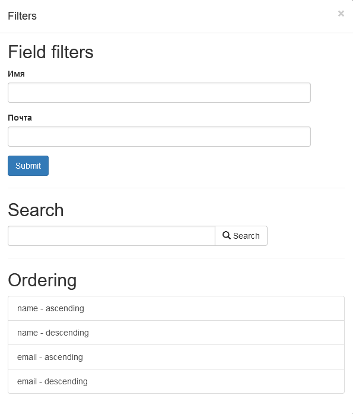

Поиск аналогично можно производить через адресную строку, по своим параметрам:

* `search` - передаёте текст, который ищется в полях указанных в `search_fields`. Происходит поиск именно вхождения искомого 
текста в текст записанного в поле, а не полное соответствие. Пример в каких строках БД таблицы Author в поле email содержится слово `user`

http://127.0.0.1:8000/api/authors_viewset/?search=user

* `ordering` - сортировка, которое принимает название поле по которому можно сортировать 
(среди допустимых полей описанных в `ordering_fields`) результат запроса. Можно передать несколько полей через запятую. По умолчанию
сортировка идёт по возрастанию, чтобы сделать по убыванию, то перед названием поля ставим `-`

Пример вывода всех авторов отсортированных по имени

http://127.0.0.1:8000/api/authors_viewset/?ordering=name

Отсортированных по имени в обратном порядке

http://127.0.0.1:8000/api/authors_viewset/?ordering=-name

Запросы фильтрации можно комбинировать. Допустим вывести всех авторов у которых в имени есть user и отсортировать их в обратном порядке по полю email

http://127.0.0.1:8000/api/authors_viewset/?search=user&ordering=-email

Комбинированные запросы выполняются в том порядке как описаны в filter_backends, т.е. в нашем случае сначала выполняется
`DjangoFilterBackend`, затем `filters.SearchFilter`, затем `filters.OrderingFilter`

# 5. Тестирование

Тестирование в Django REST Framework (DRF) обычно включает в себя проверку функциональности представлений API, 
сериализаторов, роутинга и других компонентов вашего приложения. Вот несколько типов тестов, которые обычно используются при разработке в DRF:

* `Тесты представлений (Views)`:

  * Проверка корректности ответа на запросы GET, POST, PUT, PATCH, DELETE.
  * Проверка обработки различных типов запросов (авторизованных и неавторизованных).
  * Тестирование обработки ошибок и возвращаемых статусов.


* `Тесты сериализаторов (Serializers)`:

  * Проверка корректности сериализации данных.
  * Тестирование валидации входных данных.
  * Проверка обработки различных типов данных (валидных и невалидных).


* `Тесты маршрутизации (Routing)`:

  * Проверка соответствия URL и представлений.
  * Тестирование динамической маршрутизации (например, в случае использования router в DRF).


* `Тесты аутентификации и авторизации`:

  * Проверка корректности работы системы аутентификации.
  * Тестирование доступа к защищенным ресурсам для авторизованных и неавторизованных пользователей.


* `Интеграционные тесты`:

  * Проверка взаимодействия различных компонентов приложения.
  * Тестирование сценариев использования на основе реальных данных.


* `Тесты производительности`:

  * Проверка скорости ответа API при обработке запросов с большим объемом данных.
  * Тестирование масштабируемости приложения.

Для написания тестов в DRF вы можете использовать стандартные инструменты тестирования Django, такие как `unittest` или `pytest`, 
а также дополнительные библиотеки, специализированные для тестирования REST API, например, `django-rest-framework-test`. 
Кроме того, DRF предоставляет некоторые вспомогательные классы для упрощения написания тестов, такие как `APITestCase`, `APIClient` и другие.

## 5.1 Тестирование AuthorViewSet

Тесты в Django пишутся в специальном файле `tests.py` в соответственном приложении. При запуске тестов в Django автоматически 
формируется новая тестовая БД, с той же самой структурой что есть, но совершенно незаполненная.

В файле `tests.py` приложения `api` пропишите

```python
from django.test import TestCase
from rest_framework.test import APITestCase
from rest_framework import status
from django.urls import reverse
from apps.db_train_alternative.models import Author
from .serializers import AuthorModelSerializer


class AuthorViewSetTestCase(APITestCase):
    fixtures = ['testdata.json']

    def setUp(self):
        print("Создаём данные в БД")
        self.author1 = Author.objects.create(name='John', email='john@example.com')
        self.author2 = Author.objects.create(name='Alice', email='alice@example.com')

    def test_list_authors(self):
        print("Запуск теста test_list_authors")
        print("______________________________")
        print(f'В таблице автор {Author.objects.count()} значения')
        url = reverse('authors-viewset-list')  # Получаем URL ссылку
        print(f"Проверяемы маршрут: {url}")
        response = self.client.get(url)
        print(f"Ответ от сервера: {response.status_code}")
        self.assertEqual(response.status_code, status.HTTP_200_OK)
        authors = Author.objects.all()
        serializer = AuthorModelSerializer(authors, many=True)
        print(f"Сериализатор вернул из БД: {serializer.data}")
        self.assertEqual(response.data['results'], serializer.data)


    def test_retrieve_author(self):
        print("Запуск теста test_retrieve_author")
        print("______________________________")
        url = reverse('authors-viewset-detail', kwargs={'pk': self.author1.pk})  # Укажите имя URL-шаблона и параметры
        print(f"Проверяемы маршрут: {url}")
        response = self.client.get(url)
        print(f"Ответ от сервера: {response.status_code}")
        self.assertEqual(response.status_code, status.HTTP_200_OK)
        author = Author.objects.get(pk=self.author1.pk)
        serializer = AuthorModelSerializer(author)
        print(f"Сериализатор вернул из БД: {serializer.data}")
        self.assertEqual(response.data, serializer.data)

    def test_create_author(self):
        print("Запуск теста test_create_author")
        print("______________________________")
        url = reverse('authors-viewset-list')  # Получаем URL ссылку
        print(f"Проверяемы маршрут: {url}")
        data = {'name': 'Bob', 'email': 'bob@example.com'}
        response = self.client.post(url, data)
        print(f"Ответ от сервера: {response.status_code}")
        self.assertEqual(response.status_code, status.HTTP_201_CREATED)
        author = Author.objects.get(name='Bob')
        serializer = AuthorModelSerializer(author)
        print(f"Сериализатор вернул из БД: {serializer.data}")
        self.assertEqual(response.data, serializer.data)

    def test_update_author(self):
        print("Запуск теста test_update_author")
        print("______________________________")
        url = reverse('authors-viewset-detail', kwargs={'pk': self.author1.pk})
        print(f"Проверяемы маршрут: {url}")
        data = {'name': 'John Doe', 'email': 'john.doe@example.com'}
        response = self.client.put(url, data)
        print(f"Ответ от сервера: {response.status_code}")
        self.assertEqual(response.status_code, status.HTTP_200_OK)
        author = Author.objects.get(pk=self.author1.pk)
        serializer = AuthorModelSerializer(author)
        print(f"Сериализатор вернул из БД: {serializer.data}")
        self.assertEqual(response.data, serializer.data)

    def test_partial_update_author(self):
        print("Запуск теста test_partial_update_author")
        print("______________________________")
        url = reverse('authors-viewset-detail', kwargs={'pk': self.author1.pk})
        print(f"Проверяемы маршрут: {url}")
        data = {'name': 'John Doe'}
        response = self.client.patch(url, data)
        print(f"Ответ от сервера: {response.status_code}")
        self.assertEqual(response.status_code, status.HTTP_200_OK)
        author = Author.objects.get(pk=self.author1.pk)
        serializer = AuthorModelSerializer(author)
        print(f"Сериализатор вернул из БД: {serializer.data}")
        self.assertEqual(response.data, serializer.data)

    def test_delete_author(self):
        print("Запуск теста test_delete_author")
        print("______________________________")
        url = reverse('authors-viewset-detail', kwargs={'pk': self.author1.pk})
        print(f"Проверяемы маршрут: {url}")
        response = self.client.delete(url)
        print(f"Ответ от сервера: {response.status_code}")
        self.assertEqual(response.status_code, status.HTTP_204_NO_CONTENT)
        self.assertFalse(Author.objects.filter(pk=self.author1.pk).exists())  # Проверка, что теперь этого автора не существует
```

Для создания теста создаётся тестовый класс наследующийся от `APITestCase`. Каждый тест записывается как метод данного класса и обязательно должен начинаться 
со слова `test`, далее можно писать любое название. 

При проверке методов API чаще следуют следующему алгоритму:
1. Определяют путь по которому будут проверять доступность endpoint, для этого можно написать путь вручную или воспользоваться функцией
`reverse` из `from django.urls import reverse`, чтобы по имени маршрута получить URL путь этого маршрута, как пример 
`url = reverse('authors-viewset-list')` запишет в переменную `url` значение `/api/authors_viewset/`


2. Как определились с маршрутом, то если это необходимо, то формируем данные которые будем передавать в запросе, допустим для POST, PUT, PATCH запроса


3. Отправляем запрос на представление, это можно сделать при помощи объекта `APIClient`, который существует в атрибуте `self.client`. По своему
существу он похож на requests. Преимущества объекта `self.client` в том, что для запуска тестов не нужно, чтобы сервер был запущен физически,
так как реальный запрос не отправляется, а просто проверяется работа представлений. 

    > В тестах Django `self.client` представляет собой клиент HTTP, который позволяет выполнять HTTP-запросы к вашему приложению Django в контексте теста. 
    Он предоставляет удобный интерфейс для отправки запросов и получения ответов без необходимости запуска сервера. Когда вы вызываете 
    методы `self.client.get()`, `self.client.post()`, `self.client.put()` и т.д., вы создаете HTTP-запрос к вашему приложению 
    Django и получаете HTTP-ответ в виде объекта HttpResponse. Это позволяет вам проверять поведение вашего приложения в различных сценариях и убеждаться, что оно работает корректно.

4. Проведение проверок полученных результатов с контрольными значениями. 
Все сравнивания в тестах полученного значения с необходимым проходят с использованием `self.assert***`, где `***` это имя 
блока для проверки определенного теста. Допустим `self.assertEqual(a, b)` сравнивает, что `a == b`, а 
`self.assertFalse(a)` сравнивает, что `a == False`

___

Запустите тесты командой в терминале

```python
python manage.py test apps.api
```

Не обращайте внимание на предупреждения со стороны модуля пагинации.

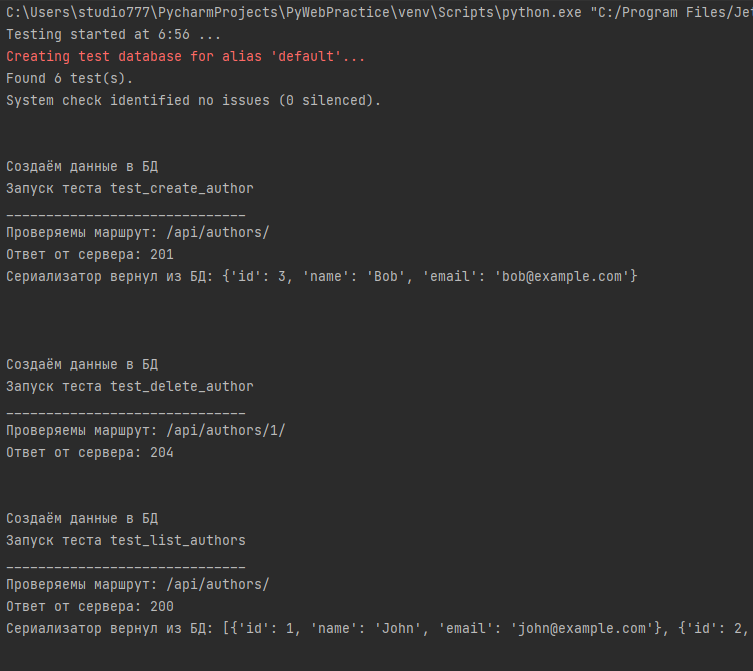

Вы можете увидеть, что тесты запускаются не по порядку как написаны, а потому как называются в отсортированном виде по имени теста,
это необходимо учитывать если планируете передавать данные между запускаемыми тестами (допустим добавили строку в БД, а в другом тесте
хотите использовать этот результат), но по умолчанию Django очищает БД каждый раз как тест завершается, чтобы новый тест был с пустой БД или 
заполненной данными определенными в `def setUp(self)`, данный метод Django запускает каждый раз после завершения `каждого теста` в своём классе.

После завершения тестов в файле `tests.py` тестовая БД самостоятельно.

Когда необходимо перед тестами создать БД, которая будет хоть как-то заполнена и чтобы это не делать в каждом тесте, то можно создать фикстуры на базе которых будут заполняться тестовые БД, 
как мы уже поняли в момент теста БД полностью пустая и после каждого теста БД будет откатываться к состоянию которое было определено на момент начало данного теста

Чтобы создать фикстуры, то необходимо:

1. Создать директорию(папку) `fixtures` внутри тестируемого приложения, в нашем случает это приложение `api`


2. В директории `fixtures` создайте файл с именем, например, `testdata.json` (или любое другое имя с расширением .json), и заполните его данными в формате JSON

```json
[
    {
        "model": "db_train_alternative.author",
        "pk": 1,
        "fields": {
            "name": "John_test",
            "email": "john_test@example.com"
        }
    },
    {
        "model": "db_train_alternative.author",
        "pk": 2,
        "fields": {
            "name": "Alice_test",
            "email": "alice_test@example.com"
        }
    }
]
```
3. В тестовом классе `AuthorViewSetTestCase` используйте классовый атрибут `fixtures` для указания имени файла фикстуры в вашем тестовом случае.
В атрибут `fixtures` передаётся список фикстур.

```python
class AuthorViewSetTestCase(APITestCase):
    fixtures = ['testdata.json']
    
    # Остальные методы ...
```
Чтобы проверить, что фикстура действительно применилась, то в `test_list_authors` проверим сколь записей есть в таблице Автор

```python
def test_list_authors(self):
    print("Запуск теста test_list_authors")
    print("______________________________")
    print(f'В таблице автор {Author.objects.count()} значения')
    # ...
```

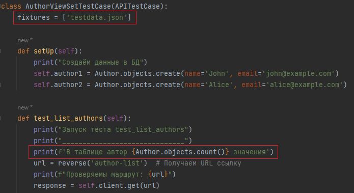

В итоге при запуске тестов будет 4 значения

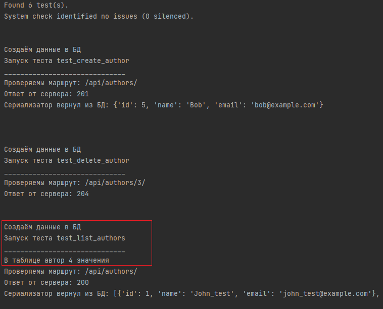

Если было бы необходимо запускать все тесты в проект, то просто не указываем конкретный проект в котором Django будет искать тесты.

В нашем случае это
```python
python manage.py test apps
```
Так как все приложения лежат в папке apps, если бы этого не было, то писали бы 

```python
python manage.py test
```

Если по каким-то причинам обязательно необходимо, чтобы данные в БД сохранялись между сессиями, то можно воспользоваться параметрами при запуске `test --keepdb` (просто для ознакомления).
Эта опция сохраняет тестовую базу данных между несколькими запусками. 

Дополнительно (если необходимо) про тестирование в Django можете прочитать [здесь](https://colab.research.google.com/drive/17cYDRQ-MnQETVJxURrOPzli65leVVxcf)

## 5.2 Самостоятельно (по желанию)

Если ранее создавали API к таблице БД, то протестируйте вашу API.

# Практика окончена

---

# <a name="section-optional-block"></a> <u>Необязательный блок</u> (выполнение по желанию, на результат следующих практик влиять не будет)

## 6. Документирование API

## 7. Использование github для концепции continuous integration (ci)
